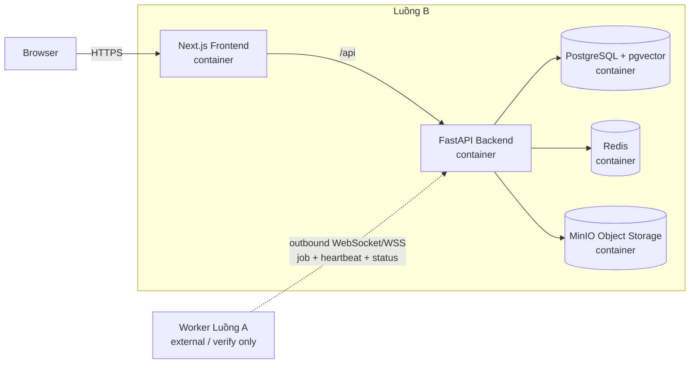

# 01 — System Architecture

## 1. Context

Luồng B chịu trách nhiệm **quản lý vòng đời test case**: xác thực/phân quyền, lưu test case có phiên bản, review/approve, tìm kiếm/filter, Test Suite, lưu kết quả chạy và audit.

Luồng B **không triển khai Agent/CARLA/ScenarioRunner**. Khi Test Suite yêu cầu chạy batch, Luồng B chỉ tạo `run_job` và trao đổi qua contract với Worker của Luồng A.

> Cập nhật 2026-10-03: hệ thống có thêm service **Agent sinh kịch bản** (`agent/`). Agent nhận prompt kèm dữ liệu CARLA (catalog) do Backend gửi, rồi trả về `.xosc` đã đặt lên làn thật của map; Backend lưu catalog, lịch sử sinh và DRAFT version. Agent không chạy CARLA. Chi tiết ở [19-agent-sinh-kich-ban.md](19-agent-sinh-kich-ban.md).

> Ghi chú tích hợp cần verify với Luồng A: Worker chủ động kết nối outbound tới Backend bằng **WebSocket/WSS** để nhận job, gửi heartbeat/trạng thái. Chi tiết Worker/CARLA không thuộc implementation scope của Luồng B.

## 2. Container architecture của Luồng B



### MinIO trong kiến trúc Luồng B

MinIO là **object storage tương thích S3** dùng để lưu file/binary artifact. Trong Luồng B, MinIO là một service riêng; Backend truy cập MinIO qua `StoragePort`, còn Domain/Application không biết SDK MinIO.

MinIO lưu:

```text
scenario-forge-artifacts/
├── xosc/{case_id}/{version_id}/{artifact_id}.xosc
├── runs/{run_job_id}/logs/{artifact_id}.log
├── runs/{run_job_id}/video/{artifact_id}.mp4
├── runs/{run_job_id}/screenshots/{artifact_id}.png
└── exports/{suite_id}/{export_id}.zip
```

PostgreSQL chỉ lưu metadata tham chiếu tới object:

```text
storage_provider = MINIO
bucket_name
object_key
etag?
sha256
size_bytes
content_type
original_name
```

Không lưu binary `.xosc`/video trực tiếp trong PostgreSQL. Object key phải bất biến; khi Creator thay file XOSC ở trạng thái DRAFT, Backend tạo artifact/object mới rồi cập nhật `xosc_artifact_id`, không ghi đè object cũ tại cùng key.

## 3. Trách nhiệm từng service

### Frontend — Next.js

- Login/register.
- Danh sách Test Case.
- Search keyword + semantic search.
- Filter theo map, adversary, environment, danger level, status, creator.
- Create/edit draft version.
- Version history và XOSC preview/download.
- Submit review.
- Review inbox, comment, approve/request-edit/reject.
- Test Suite CRUD.
- Batch run status/results.
- Audit viewer cho Admin.
- Chỉ gọi FastAPI; không truy cập PostgreSQL/Redis/filesystem trực tiếp.

### Backend — FastAPI

- REST API.
- Authentication + authorization.
- Business rules cho version/review/Test Suite.
- Search/filter orchestration.
- Semantic retrieval qua `EmbeddingPort` + pgvector.
- Persistence qua repository interfaces.
- Audit append-only.
- Tạo/điều phối `run_job`.
- MinIO object storage adapter qua `StoragePort`.
- Contract tích hợp với Worker Luồng A.

### PostgreSQL + pgvector

Source of truth cho:

- users/roles/sessions;
- test case + versions + tags;
- reviews/comments;
- suites/suite items/suite runs;
- run jobs/results;
- artifact metadata;
- audit logs;
- vector embedding cho semantic search.

Structured filter vẫn dùng column/index PostgreSQL bình thường. Vector chỉ phục vụ similarity search.

### Redis

Luồng B dùng Redis cho các tác vụ ngắn hạn như:

- queue/pointer của `run_job` nếu cần;
- cache ngắn hạn;
- trạng thái/lease tạm thời khi tích hợp execution.

Redis không phải source of truth. Trạng thái nghiệp vụ lâu dài nằm ở PostgreSQL.

### MinIO object storage

MinIO lưu:

- `.xosc`;
- run log;
- screenshot/video nếu có;
- Test Suite export.

MVP có thể để Browser upload/download qua FastAPI để RBAC đơn giản. Với file lớn, Backend có thể cấp presigned URL ngắn hạn sau khi authorize; MinIO vẫn không được public bucket.

## 4. Worker/WebSocket — chỉ là boundary với Luồng A

Tài liệu nguồn mô tả Worker đặt cạnh CARLA và **chủ động kết nối ra Backend**. Với quyết định của nhóm, kênh runtime được hiểu là WebSocket/WSS.

Luồng B chỉ cần biết các message contract mức cao:

```text
WORKER_HELLO
WORKER_HEARTBEAT
JOB_OFFER / JOB_ASSIGN
JOB_STARTED
JOB_PROGRESS
JOB_COMPLETED
JOB_FAILED
```

Luồng B chịu trách nhiệm:

```text
create run_job
persist job state
persist RunResult
persist artifact metadata
write audit log
```

Luồng A chịu trách nhiệm verify/implement:

```text
WebSocket connection lifecycle
CARLA / ScenarioRunner execution
heartbeat frequency
job execution
runtime recovery
upload/send execution result
```

Do đó **không đặt Worker/CARLA thành container của Luồng B**.

## 5. Search architecture

Có 2 loại tìm kiếm và không nên trộn trách nhiệm:

### Structured filter

```text
map_code
ego_vehicle_code
adversary_type
environment_code
danger_level
status
creator_id
tag
```

Được thực hiện bằng SQL `WHERE` + B-tree/GIN index.

### Semantic/RAG retrieval

Ví dụ query:

```text
"Tìm scenario người đi bộ bất ngờ băng qua đường trong mưa, mức nguy hiểm cao"
```

Backend:

```text
query
  -> explicit filters từ UI
  -> optional query parser
  -> EmbeddingPort.embed(query)
  -> PostgreSQL WHERE structured filters
  -> pgvector similarity ranking
  -> TestCaseSummary[]
```

Chi tiết ở `13-rag-search-filter.md`.

## 6. Bounded modules trong Backend

```text
identity     -> auth, user, role, session
testcase     -> test case, version, tags, xosc
search       -> structured filter, FTS, semantic retrieval
review       -> review request, decision, comments
testsuite    -> suites, approved items, export
execution    -> run job/result contract với Luồng A
audit        -> immutable activity trail
storage      -> MinIO/S3-compatible adapter
```

Các module giao tiếp qua application interfaces/use cases, không import SQLAlchemy model của nhau.

## 7. Core invariants

1. `run_result.test_case_version_id` xác định đúng version đã chạy.
2. `test_suite_item` chỉ chứa version `APPROVED`.
3. Version đã submit review không được chỉnh nội dung tại chỗ.
4. Approve/reject chỉ qua permission `review:decide`.
5. Mọi create/update/submit/approve/request-edit/reject/suite-run đều có audit.
6. XOSC có checksum để phát hiện file bị thay đổi ngoài luồng.
7. Semantic search không được bypass RBAC/visibility rule.
8. Filter explicit từ UI luôn ưu tiên hơn constraint suy ra từ natural-language query.

## 8. Failure boundaries

- Backend restart: PostgreSQL và MinIO volume giữ dữ liệu.
- Redis lỗi: không mất Test Case/Review/Result đã persist trong PostgreSQL.
- Embedding provider lỗi: fallback về structured filter + keyword search.
- Vector chưa index xong: Test Case vẫn tìm được bằng filter/keyword.
- Worker Luồng A mất kết nối: `run_job` giữ trạng thái chờ/retry theo integration contract; không làm treo HTTP request.
- MinIO lỗi: API trả `StorageUnavailable`, không commit metadata giả; job upload có thể retry theo policy.
