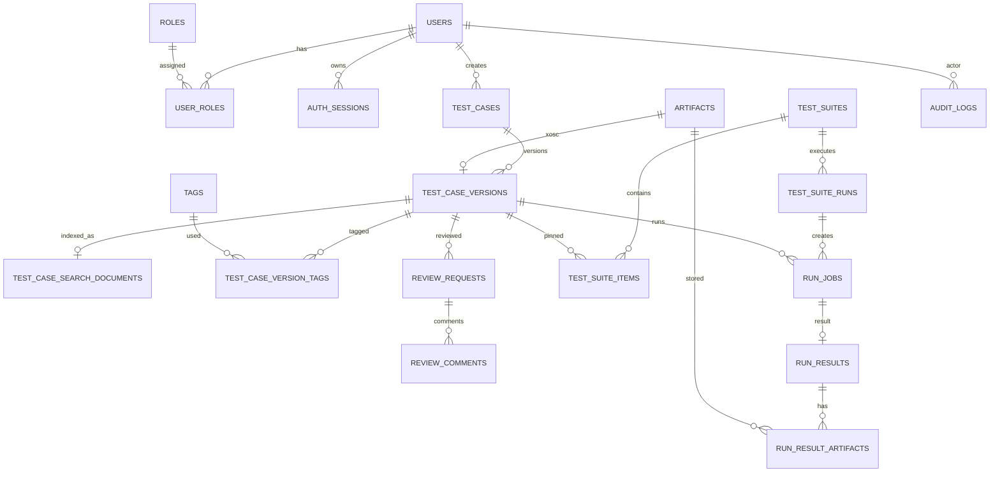

# 04 — PostgreSQL Database Design

## 1. ERD tổng quát



## 2. Enum đề xuất

```sql
CREATE TYPE version_status AS ENUM (
  'DRAFT', 'IN_REVIEW', 'EDIT', 'APPROVED', 'REJECTED'
);

CREATE TYPE danger_level AS ENUM (
  'LOW', 'MEDIUM', 'HIGH', 'CRITICAL'
);

CREATE TYPE run_job_status AS ENUM (
  'QUEUED', 'CLAIMED', 'RUNNING',
  'COMPLETED', 'FAILED', 'CANCELLED'
);

CREATE TYPE run_verdict AS ENUM (
  'PASS', 'FAIL', 'ERROR'
);
```

Danger level cần được chốt thành một taxonomy duy nhất ở Backend/Database; frontend chỉ hiển thị và gửi giá trị theo contract.

## 3. Identity tables

```sql
CREATE TABLE users (
  id uuid PRIMARY KEY,
  email text NOT NULL UNIQUE,
  password_hash text NOT NULL,
  display_name text NOT NULL,
  is_active boolean NOT NULL DEFAULT true,
  created_at timestamptz NOT NULL DEFAULT now(),
  updated_at timestamptz NOT NULL DEFAULT now()
);

-- Quyền gắn theo Project: role + responsibilities (migration 0007, xem 06-auth-rbac-approval.md)
CREATE TABLE roles (
  code varchar(32) PRIMARY KEY,               -- 'ADMIN' | 'MEMBER'
  name varchar(80) NOT NULL,
  description text
);

CREATE TABLE responsibilities (
  code varchar(32) PRIMARY KEY,               -- 'TESTCASE_CREATE' | 'TESTCASE_REVIEW' | 'TESTCASE_SELF_REVIEW'
  name varchar(80) NOT NULL,
  description text,
  requires_code varchar(32) REFERENCES responsibilities(code)  -- SELF_REVIEW -> REVIEW
);

CREATE TABLE project_users (
  project_id bigint NOT NULL REFERENCES projects(id) ON DELETE CASCADE,
  user_id bigint NOT NULL REFERENCES users(id) ON DELETE CASCADE,
  role_code varchar(32) NOT NULL REFERENCES roles(code),
  added_by bigint NOT NULL REFERENCES users(id) ON DELETE RESTRICT,
  created_at timestamptz NOT NULL DEFAULT now(),
  updated_at timestamptz NOT NULL DEFAULT now(),
  PRIMARY KEY (project_id, user_id)
);

CREATE TABLE project_user_responsibilities (
  project_id bigint NOT NULL,
  user_id bigint NOT NULL,
  responsibility_code varchar(32) NOT NULL REFERENCES responsibilities(code),
  assigned_by bigint NOT NULL REFERENCES users(id) ON DELETE RESTRICT,
  assigned_at timestamptz NOT NULL DEFAULT now(),
  PRIMARY KEY (project_id, user_id, responsibility_code),
  FOREIGN KEY (project_id, user_id) REFERENCES project_users(project_id, user_id) ON DELETE CASCADE
);

CREATE TABLE auth_sessions (
  id uuid PRIMARY KEY,
  user_id uuid NOT NULL REFERENCES users(id) ON DELETE CASCADE,
  refresh_token_hash text NOT NULL,
  expires_at timestamptz NOT NULL,
  revoked_at timestamptz,
  created_at timestamptz NOT NULL DEFAULT now(),
  last_used_at timestamptz
);
```

Public register chỉ gán `CREATOR`. Việc thêm `REVIEWER` hoặc `ADMIN` phải qua Admin endpoint/seed.

## 4. Artifact table

```sql
CREATE TABLE artifacts (
  id uuid PRIMARY KEY,
  kind text NOT NULL,
  storage_provider text NOT NULL DEFAULT 'MINIO',
  bucket_name text NOT NULL,
  object_key text NOT NULL,
  etag text,
  original_name text,
  content_type text,
  size_bytes bigint NOT NULL CHECK (size_bytes >= 0),
  sha256 char(64) NOT NULL,
  created_by uuid REFERENCES users(id),
  created_at timestamptz NOT NULL DEFAULT now(),
  deleted_at timestamptz,
  metadata jsonb NOT NULL DEFAULT '{}'::jsonb,
  UNIQUE (bucket_name, object_key)
);
```

Không expose credential MinIO hoặc object key như quyền truy cập. API luôn authorize trước khi stream hoặc cấp presigned URL ngắn hạn. `sha256` là integrity checksum do ứng dụng quản lý; không dùng `etag` thay cho SHA-256.

## 5. Test case và version

```sql
CREATE TABLE test_cases (
  id uuid PRIMARY KEY,
  case_key text NOT NULL UNIQUE,
  title text NOT NULL,
  description text,
  created_by uuid NOT NULL REFERENCES users(id),
  created_at timestamptz NOT NULL DEFAULT now(),
  updated_at timestamptz NOT NULL DEFAULT now(),
  archived_at timestamptz
);

CREATE TABLE test_case_versions (
  id uuid PRIMARY KEY,
  test_case_id uuid NOT NULL REFERENCES test_cases(id) ON DELETE CASCADE,
  version_no integer NOT NULL CHECK (version_no >= 1),
  status version_status NOT NULL DEFAULT 'DRAFT',

  map_code text NOT NULL,
  ego_vehicle_code text NOT NULL,
  adversary_type text NOT NULL,
  environment_code text NOT NULL,
  danger_level danger_level NOT NULL,

  scenario_input jsonb NOT NULL DEFAULT '{}'::jsonb,
  xosc_artifact_id uuid NOT NULL REFERENCES artifacts(id),
  change_note text,

  created_by uuid NOT NULL REFERENCES users(id),
  created_at timestamptz NOT NULL DEFAULT now(),
  submitted_at timestamptz,
  decided_at timestamptz,
  decided_by uuid REFERENCES users(id),

  UNIQUE (test_case_id, version_no)
);
```

`scenario_input` giữ phần shared input chưa cần filter riêng. Các trường cần lọc thường xuyên phải là column thật, không nhét hết vào JSONB.

## 6. Tags

```sql
CREATE TABLE tags (
  id uuid PRIMARY KEY,
  name citext NOT NULL UNIQUE
);

CREATE TABLE test_case_version_tags (
  version_id uuid NOT NULL REFERENCES test_case_versions(id) ON DELETE CASCADE,
  tag_id uuid NOT NULL REFERENCES tags(id) ON DELETE CASCADE,
  PRIMARY KEY (version_id, tag_id)
);
```

Cần extension:

```sql
CREATE EXTENSION IF NOT EXISTS citext;
```

## 7. Review

```sql
CREATE TABLE review_requests (
  id uuid PRIMARY KEY,
  version_id uuid NOT NULL REFERENCES test_case_versions(id),
  requested_by uuid NOT NULL REFERENCES users(id),
  requested_at timestamptz NOT NULL DEFAULT now(),
  resolved_by uuid REFERENCES users(id),
  resolved_at timestamptz,
  decision text CHECK (decision IN ('APPROVED','REJECTED')),
  UNIQUE (version_id)
);

CREATE TABLE review_comments (
  id uuid PRIMARY KEY,
  review_request_id uuid NOT NULL REFERENCES review_requests(id) ON DELETE CASCADE,
  author_id uuid NOT NULL REFERENCES users(id),
  body text NOT NULL CHECK (length(trim(body)) > 0),
  comment_type text NOT NULL DEFAULT 'COMMENT'
      CHECK (comment_type IN ('COMMENT','DECISION')),
  created_at timestamptz NOT NULL DEFAULT now()
);
```

## 8. Test Suite

```sql
CREATE TABLE test_suites (
  id uuid PRIMARY KEY,
  name text NOT NULL,
  description text,
  created_by uuid NOT NULL REFERENCES users(id),
  created_at timestamptz NOT NULL DEFAULT now(),
  updated_at timestamptz NOT NULL DEFAULT now()
);

CREATE TABLE test_suite_items (
  suite_id uuid NOT NULL REFERENCES test_suites(id) ON DELETE CASCADE,
  test_case_version_id uuid NOT NULL REFERENCES test_case_versions(id),
  position integer NOT NULL DEFAULT 0,
  added_by uuid NOT NULL REFERENCES users(id),
  added_at timestamptz NOT NULL DEFAULT now(),
  PRIMARY KEY (suite_id, test_case_version_id)
);
```

Business rule “approved only” được enforce ở application service. Có thể thêm DB trigger như defense-in-depth:

```sql
CREATE OR REPLACE FUNCTION enforce_approved_suite_item()
RETURNS trigger AS $$
BEGIN
  IF NOT EXISTS (
    SELECT 1 FROM test_case_versions
    WHERE id = NEW.test_case_version_id
      AND status = 'APPROVED'
  ) THEN
    RAISE EXCEPTION 'Only APPROVED test case versions can be added to a suite';
  END IF;
  RETURN NEW;
END;
$$ LANGUAGE plpgsql;

CREATE TRIGGER trg_suite_item_approved
BEFORE INSERT OR UPDATE ON test_suite_items
FOR EACH ROW EXECUTE FUNCTION enforce_approved_suite_item();
```

## 9. Batch run và result

```sql
CREATE TABLE test_suite_runs (
  id uuid PRIMARY KEY,
  suite_id uuid NOT NULL REFERENCES test_suites(id),
  requested_by uuid NOT NULL REFERENCES users(id),
  status text NOT NULL CHECK (status IN ('QUEUED','RUNNING','COMPLETED','FAILED','CANCELLED')),
  total_jobs integer NOT NULL DEFAULT 0,
  completed_jobs integer NOT NULL DEFAULT 0,
  created_at timestamptz NOT NULL DEFAULT now(),
  started_at timestamptz,
  finished_at timestamptz
);

CREATE TABLE run_jobs (
  id uuid PRIMARY KEY,
  suite_run_id uuid REFERENCES test_suite_runs(id) ON DELETE CASCADE,
  test_case_version_id uuid NOT NULL REFERENCES test_case_versions(id),
  status run_job_status NOT NULL DEFAULT 'QUEUED',
  idempotency_key text NOT NULL UNIQUE,
  worker_id text,
  attempt integer NOT NULL DEFAULT 0,
  max_attempts integer NOT NULL DEFAULT 3,
  queued_at timestamptz NOT NULL DEFAULT now(),
  claimed_at timestamptz,
  started_at timestamptz,
  finished_at timestamptz,
  error_code text,
  error_message text
);

CREATE TABLE run_results (
  id uuid PRIMARY KEY,
  run_job_id uuid NOT NULL UNIQUE REFERENCES run_jobs(id) ON DELETE CASCADE,
  test_case_version_id uuid NOT NULL REFERENCES test_case_versions(id),
  verdict run_verdict NOT NULL,
  metrics jsonb NOT NULL DEFAULT '{}'::jsonb,
  scenario_runner_exit_code integer,
  duration_ms bigint,
  created_at timestamptz NOT NULL DEFAULT now()
);

CREATE TABLE run_result_artifacts (
  run_result_id uuid NOT NULL REFERENCES run_results(id) ON DELETE CASCADE,
  artifact_id uuid NOT NULL REFERENCES artifacts(id),
  role text NOT NULL CHECK (role IN ('LOG','VIDEO','SCREENSHOT','REPORT','OTHER')),
  PRIMARY KEY (run_result_id, artifact_id)
);
```

`run_results.test_case_version_id` có vẻ lặp với `run_jobs`, nhưng giúp query/audit rõ và có thể enforce equality khi insert.

## 10. Audit log

```sql
CREATE TABLE audit_logs (
  id bigserial PRIMARY KEY,
  actor_user_id uuid REFERENCES users(id),
  action text NOT NULL,
  entity_type text NOT NULL,
  entity_id uuid,
  entity_version_id uuid,
  request_id uuid,
  ip inet,
  user_agent text,
  before_data jsonb,
  after_data jsonb,
  created_at timestamptz NOT NULL DEFAULT now()
);
```

Production nên dùng DB role khiến application có `INSERT, SELECT` nhưng không có `UPDATE, DELETE` trên `audit_logs`.

## 11. Indexes cho filter

```sql
CREATE INDEX idx_tcv_map ON test_case_versions(map_code);
CREATE INDEX idx_tcv_adversary ON test_case_versions(adversary_type);
CREATE INDEX idx_tcv_environment ON test_case_versions(environment_code);
CREATE INDEX idx_tcv_danger ON test_case_versions(danger_level);
CREATE INDEX idx_tcv_status ON test_case_versions(status);
CREATE INDEX idx_tcv_creator ON test_case_versions(created_by);
CREATE INDEX idx_tcv_case_version ON test_case_versions(test_case_id, version_no DESC);
CREATE INDEX idx_test_cases_created_at ON test_cases(created_at DESC);
CREATE INDEX idx_review_open ON review_requests(resolved_at) WHERE resolved_at IS NULL;
CREATE INDEX idx_jobs_status_queued ON run_jobs(status, queued_at) WHERE status = 'QUEUED';
CREATE INDEX idx_audit_entity ON audit_logs(entity_type, entity_id, created_at DESC);
CREATE INDEX idx_audit_actor ON audit_logs(actor_user_id, created_at DESC);
```

Nếu free-text search title/description cần tốt hơn:

```sql
CREATE INDEX idx_test_cases_fts
ON test_cases USING gin (
  to_tsvector('simple', coalesce(title,'') || ' ' || coalesce(description,''))
);
```

Semantic search dùng `pgvector`. Structured filter vẫn dùng các index phía trên; vector không thay thế B-tree/GIN filter.

```sql
CREATE EXTENSION IF NOT EXISTS vector;

CREATE TABLE test_case_search_documents (
  version_id uuid PRIMARY KEY REFERENCES test_case_versions(id) ON DELETE CASCADE,
  search_text text NOT NULL,
  embedding vector(768), -- ví dụ; phải khớp embedding model
  embedding_model text,
  embedding_status text NOT NULL DEFAULT 'PENDING'
    CHECK (embedding_status IN ('PENDING','READY','FAILED')),
  content_hash char(64) NOT NULL,
  indexed_at timestamptz,
  last_error text
);

CREATE INDEX idx_tc_search_embedding_hnsw
ON test_case_search_documents
USING hnsw (embedding vector_cosine_ops)
WHERE embedding_status = 'READY';
```

Chi tiết query/indexing ở `13-rag-search-filter.md`.

## 12. Concurrency

Các thao tác sau nên `SELECT ... FOR UPDATE`:

- lấy `next version_no`;
- submit review;
- approve/reject;
- worker claim job;
- update suite run counters.

Không dựa vào frontend để tránh double-click race condition.
