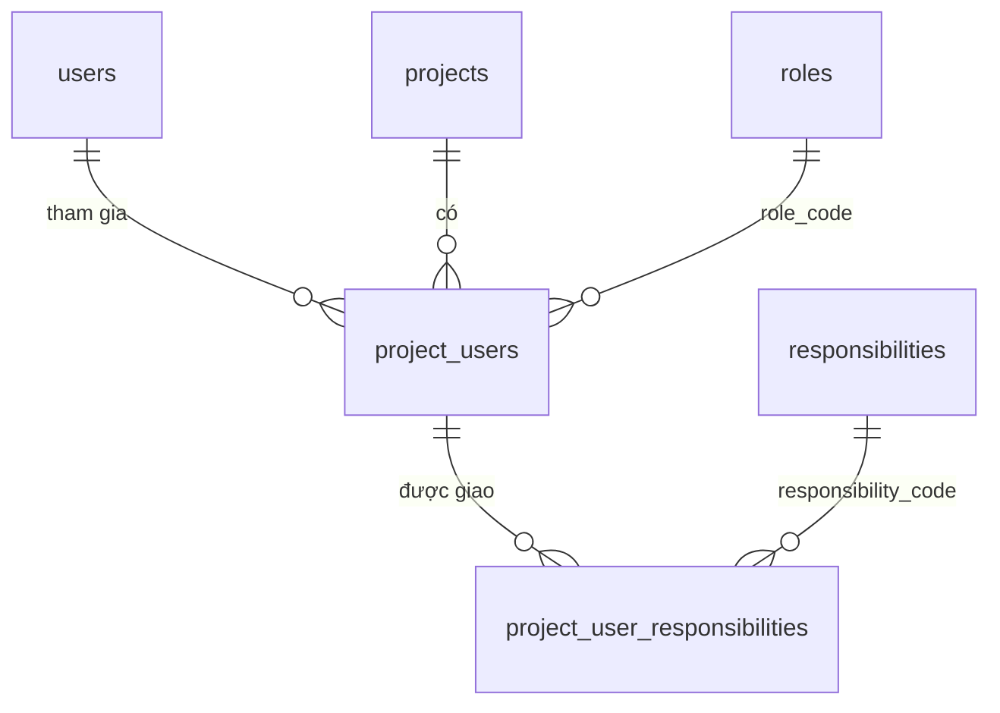
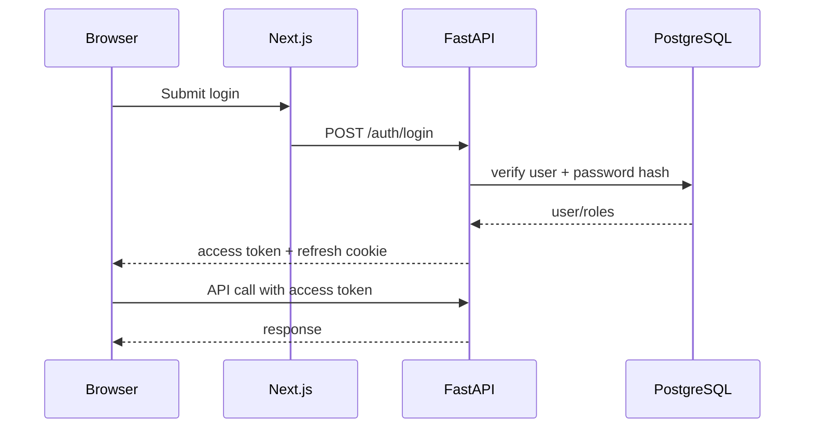
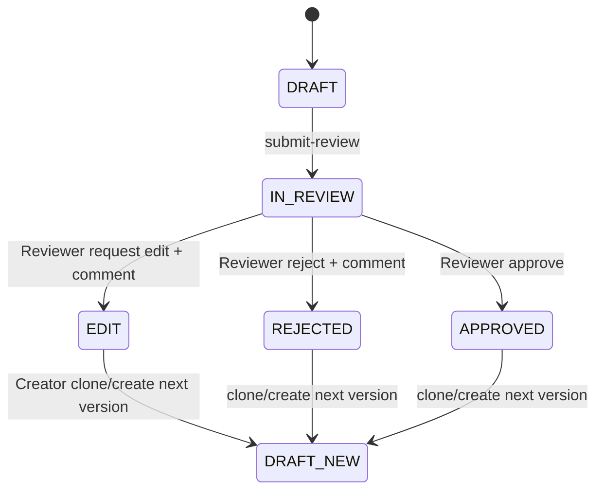

# 06 — Authentication, RBAC và Approval Workflow

## 1. Role và Responsibility

Quyền trong một Project chia thành hai trục độc lập, đều gắn với từng Project (`project_users`):

- **Role** (`roles`): `ADMIN` hoặc `MEMBER`. Role quyết định quyền quản trị.
- **Responsibility** (`responsibilities`, gán qua `project_user_responsibilities`): quyết định ai được làm việc với test case.
  - `TESTCASE_CREATE`: tạo, sửa và submit test case; quản lý Test Suite.
  - `TESTCASE_REVIEW`: xem, comment và duyệt review.
  - `TESTCASE_SELF_REVIEW`: được duyệt test case do chính mình tạo. Chỉ gán được khi đã có `TESTCASE_REVIEW` (`responsibilities.requires_code`).

Role `ADMIN` không tự có responsibility nào. Admin muốn tạo hoặc duyệt test case thì cũng phải được giao nhiệm vụ như mọi người.



Người tạo Project (`projects.created_by`):

- luôn là `ADMIN`; role của họ không ai đổi được, kể cả chính họ;
- khi tạo Project được giao sẵn cả 3 responsibility, sau đó có thể sửa responsibility (của chính mình hoặc do Admin khác sửa);
- không bị xóa khỏi Project và không thể rời Project;
- là người duy nhất được xóa Project.

Các ràng buộc của người tạo chỉ được kiểm tra ở backend (`ensure_can_change_role`, `ensure_can_remove_member`, `ensure_can_leave` trong `app/shared/domain/policies.py`). DB không dùng trigger cho phần này, nên mọi thao tác thay đổi membership phải đi qua API.

Permission matrix (`app/shared/domain/policies.py`):

| Permission | Mọi thành viên | ADMIN | Người tạo | CREATE | REVIEW | SELF_REVIEW |
|---|:---:|:---:|:---:|:---:|:---:|:---:|
| `testcase:read`, `suite:read`, `suite:run`, `member:read` (xem danh sách phân quyền) | ✓ | | | | | |
| `member:manage`, `project:update`, `audit:read` | | ✓ | | | | |
| `project:delete` | | | ✓ | | | |
| `testcase:create`, `testcase:update_own_draft`, `testcase:submit_review`, `suite:manage` | | | | ✓ | | |
| `review:read`, `review:comment`, `review:decide` | | | | | ✓ | |
| `review:decide_own` | | | | | | ✓ |

API trả quyền thực tế của từng người trong `ProjectSummary.permissions`, nên frontend không phải tự giữ một bản ma trận riêng.

Quy tắc quản lý thành viên (chỉ `ADMIN`):

| Hành động | Ràng buộc |
|---|---|
| Thêm người bằng email, chọn role và responsibility | Email chưa có tài khoản sẽ được tạo ở trạng thái `PENDING_REGISTRATION` |
| Đổi role (`PATCH /projects/{id}/users/{user_id}/role`) | Không đổi role của người tạo. Admin khác được tự hạ mình xuống `MEMBER` |
| Phân nhiệm vụ (`PUT /projects/{id}/users/{user_id}/responsibilities`) | Áp dụng cho mọi thành viên, kể cả chính mình và người tạo |
| Xóa thành viên (`DELETE /projects/{id}/users/{user_id}`) | Không xóa chính mình. Không xóa người tạo |
| Xóa Project (`DELETE /projects/{id}`) | Chỉ người tạo. Soft delete qua `projects.deleted_at` |

Mọi thành viên trừ người tạo đều có thể tự rời Project (`POST /projects/{id}/leave`). Bất kỳ user đã đăng nhập nào cũng tạo được Project mới.

## 2. Authentication flow



Password hashing: Argon2id.

Refresh tokens:

- random opaque value;
- only hash stored in DB;
- rotation on refresh;
- revoke on logout/password change/disable user.

## 3. Authorization implementation

Application service gọi một abstraction:

```python
class Authorizer(Protocol):
    def require(self, actor: Principal, permission: str) -> None: ...
```

FastAPI dependency có thể reject sớm, nhưng use case vẫn nên enforce permission cho command nhạy cảm để không lệ thuộc HTTP layer.

## 4. Ownership rule

Người có `TESTCASE_CREATE` chỉ sửa draft do mình tạo. Admin (`member:manage`) có thể sửa draft của người khác.

```text
can_edit =
  version.status == DRAFT
  AND (
    actor.id == version.created_by
    OR actor has explicit elevated permission
  )
```

Không suy ra “Admin được làm mọi thứ” nếu product requirement không nói vậy.

## 5. Approval state machine



`DRAFT_NEW` là một row version mới, không phải thay status của row cũ.

## 6. Transition rules

### DRAFT -> IN_REVIEW

Yêu cầu:

- 5 trường bắt buộc hợp lệ;
- XOSC artifact tồn tại;
- checksum đã tính;
- nếu hệ thống bật XOSC validation thì file phải pass validator trước khi được submit;
- actor có `testcase:submit_review`;
- version chưa có open review.

Effects:

- status -> `IN_REVIEW`;
- `submitted_at=now()`;
- tạo `review_request`;
- optional initial comment;
- audit `REVIEW_SUBMITTED`.

### IN_REVIEW -> APPROVED

Yêu cầu:

- actor có `review:decide`;
- review đang open;
- optimistic/pessimistic lock tránh 2 reviewer quyết định đồng thời.

Effects:

- version status `APPROVED`;
- review decision `APPROVED`;
- decision comment;
- `resolved_by`, `resolved_at`;
- audit `REVIEW_APPROVED`.

### IN_REVIEW -> REJECTED

Giống approve nhưng:

- comment là bắt buộc;
- version `REJECTED`;
- muốn sửa phải tạo version N+1 `DRAFT`.

### IN_REVIEW -> EDIT

- Reviewer yêu cầu Creator chỉnh sửa, comment là bắt buộc;
- version hiện tại trở thành `EDIT` và vẫn immutable để giữ snapshot đã review;
- Creator clone version đó thành version N+1 `DRAFT`, cập nhật metadata/XOSC rồi submit review lại;
- audit `REVIEW_EDIT_REQUESTED` lưu đầy đủ người yêu cầu và nội dung nhận xét.

## 7. Self-review

Mặc định không ai được duyệt test case do chính mình tạo. Muốn tự duyệt, thành viên phải có responsibility `TESTCASE_SELF_REVIEW` (cấp permission `review:decide_own`).

```python
def ensure_can_decide(version_creator_id, actor_id, permissions):
    require_permission(permissions, "review:decide")
    if version_creator_id == actor_id and "review:decide_own" not in permissions:
        raise Forbidden
```

Biến môi trường `ALLOW_SELF_REVIEW` không còn được dùng.

## 8. Approved version immutability

Sau approve:

- không sửa metadata;
- không replace `.xosc`;
- không sửa tags nếu tags được coi là versioned metadata;
- mọi thay đổi -> clone thành next version.

Nhờ vậy `Suite Item -> Version -> XOSC SHA256` tạo được chain reproducible.
