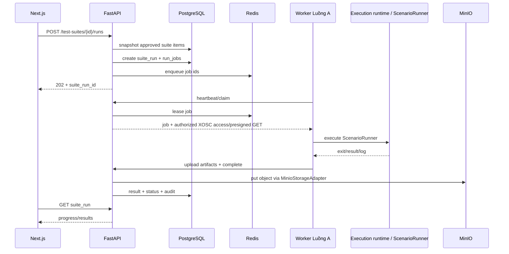

# 07 — Test Suite, Batch Run và ScenarioRunner Integration

## 1. Test Suite semantics

Suite không trỏ vào `test_case_id`; suite trỏ vào **`test_case_version_id`**.

Ví dụ:

```text
Suite: Night Regression
  - TC-001 version 2 APPROVED
  - TC-004 version 5 APPROVED
  - TC-021 version 1 APPROVED
```

Nếu TC-001 có version 3 sau này, suite không tự đổi sang v3. User phải chủ động replace để giữ reproducibility.

## 2. Add item transaction

```text
BEGIN
  SELECT version FOR SHARE/UPDATE
  assert status == APPROVED
  INSERT suite_item
  INSERT audit_log
COMMIT
```

Nếu version không approved -> HTTP 409.

## 3. Run batch flow



## 4. Snapshot khi bắt đầu suite run

Khi user bấm Run, backend tạo `run_jobs` từ danh sách suite items tại thời điểm đó.

Sau đó dù suite bị add/remove item thì run đang chạy không thay đổi.

Đây là snapshot semantics cần để kết quả batch có thể tái lập.

## 5. Queue model

Redis chỉ chứa pointer:

```json
{
  "run_job_id": "uuid"
}
```

Payload thật lấy từ PostgreSQL để tránh queue trở thành source of truth.

## 6. Integration state với Worker Luồng A

State:

```text
QUEUED -> CLAIMED -> RUNNING -> COMPLETED
                         \----> FAILED
```

Ở mức contract, khi Worker Luồng A nhận job:

- lock một job;
- set worker_id;
- set lease expiry trong Redis/DB;
- heartbeat gia hạn lease;
- concurrency/lifecycle chi tiết do Luồng A quyết định; Luồng B chỉ persist trạng thái nhận được qua integration contract.

Nếu Worker mất heartbeat:

- job `CLAIMED/RUNNING` được recovery process đánh dấu retryable;
- `attempt += 1`;
- nếu `attempt < max_attempts`, enqueue lại;
- nếu hết retry, `FAILED` với error code rõ ràng.

## 7. Structured error codes

```text
EXECUTION_RUNTIME_CRASH
SCENARIO_RUNNER_TIMEOUT
XOSC_INVALID
SPAWN_FAILED
WORKER_DISCONNECTED
ARTIFACT_UPLOAD_FAILED
UNKNOWN_EXECUTION_ERROR
```

UI không parse string log để biết loại lỗi.

## 8. Result criteria

`verdict` ở mức tối thiểu:

```text
PASS
FAIL
ERROR
```

- `FAIL`: scenario chạy hoàn tất nhưng vi phạm criteria, ví dụ collision.
- `ERROR`: không thể đánh giá scenario vì hạ tầng/runtime lỗi.

Metrics giữ JSONB để mở rộng:

```json
{
  "collision_count": 0,
  "lane_invasion_count": 1,
  "timeout": false,
  "duration_sec": 37.41
}
```

Các metric trọng yếu có thể promote thành columns sau khi schema ổn định.

## 9. Export sang ScenarioRunner

Endpoint:

```http
POST /test-suites/{suite_id}/export
```

Output `.zip`:

```text
suite-night-regression-2026-09-28/
├── manifest.json
├── scenarios/
│   ├── TC-001_v2_<sha>.xosc
│   ├── TC-004_v5_<sha>.xosc
│   └── TC-021_v1_<sha>.xosc
└── checksums.sha256
```

`manifest.json`:

```json
{
  "suite_id": "...",
  "suite_name": "Night Regression",
  "exported_at": "...",
  "items": [
    {
      "case_key": "TC-001",
      "version": 2,
      "version_id": "...",
      "file": "scenarios/TC-001_v2_abc.xosc",
      "sha256": "..."
    }
  ]
}
```

Export phải kiểm tra toàn bộ item vẫn tồn tại và artifact checksum đúng.

## 10. Single test run

Ngoài batch suite, có thể có:

```http
POST /test-case-versions/{id}/runs
```

Trong phạm vi Luồng B, **batch run của Test Suite chỉ chạy version `APPROVED`**. Nếu sau này hệ thống cần chế độ chạy thử cho draft, nên thiết kế thành một use case/permission riêng thay vì nới lỏng invariant của Test Suite.
