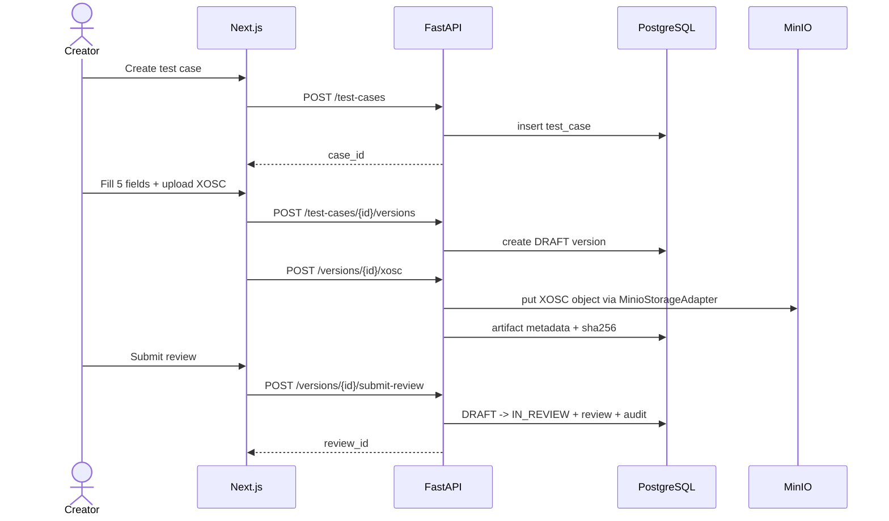
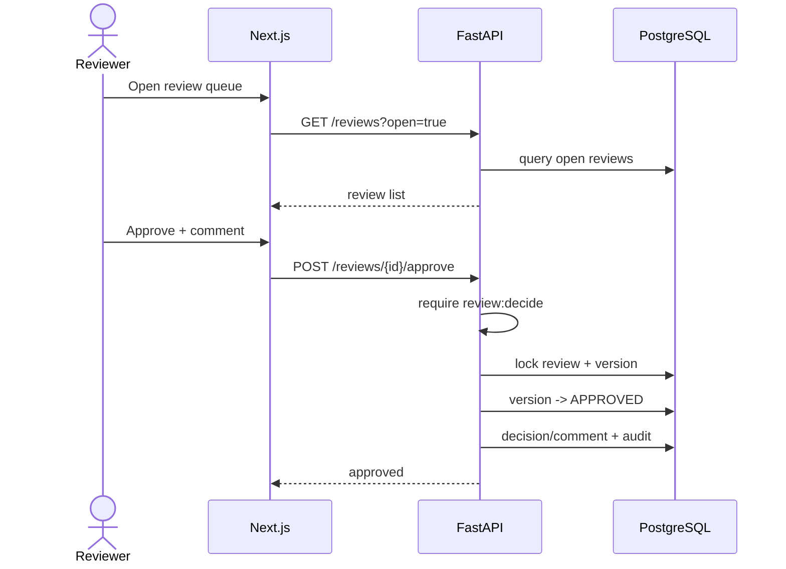
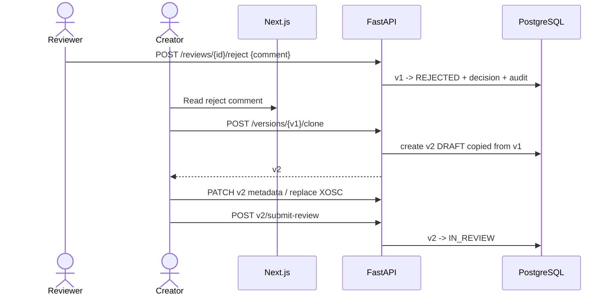
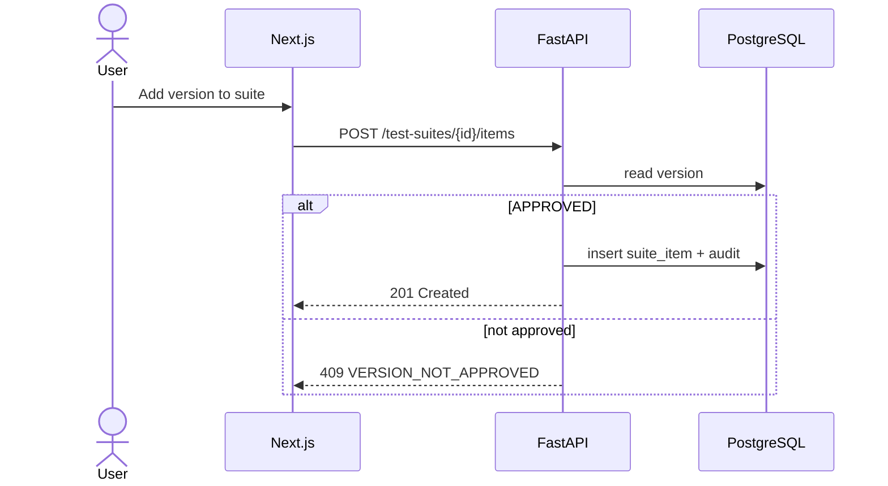
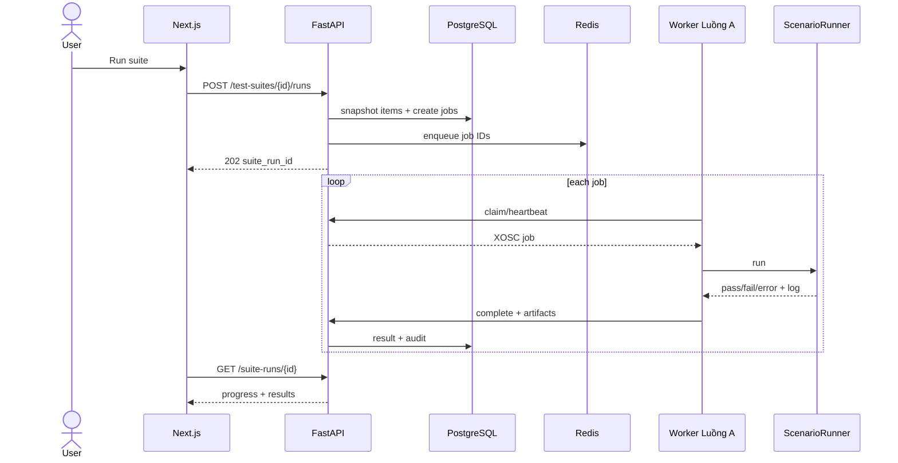
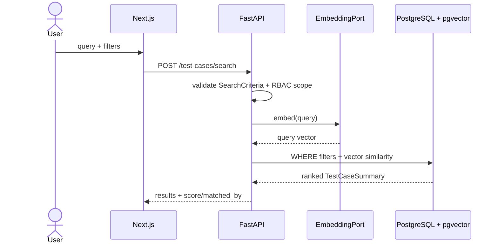

# 12 — Sequence Diagrams cho Demo Luồng B

## 1. Creator tạo test case và submit review



## 2. Reviewer approve



## 3. Reviewer reject, Creator tạo version mới



## 4. Add approved version vào suite



## 5. Run batch và xem kết quả



## 6. Traceability chain

Một kết quả bất kỳ phải lần ngược được:

```text
RunResult
  -> RunJob
  -> TestCaseVersion
  -> TestCase
  -> XOSC Artifact (SHA256)
  -> ReviewRequest / Reviewer / Comment
  -> SuiteRun / TestSuite
  -> AuditLog events
```

Đây là chain chính để chứng minh tiêu chí “truy vết được ai làm gì với mọi test case”.


## 7. Hybrid semantic search



Nếu embedding unavailable, API fallback về keyword + structured filter theo contract.
