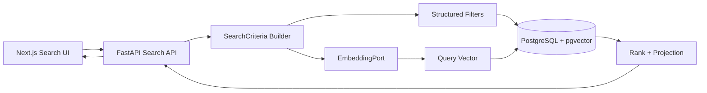
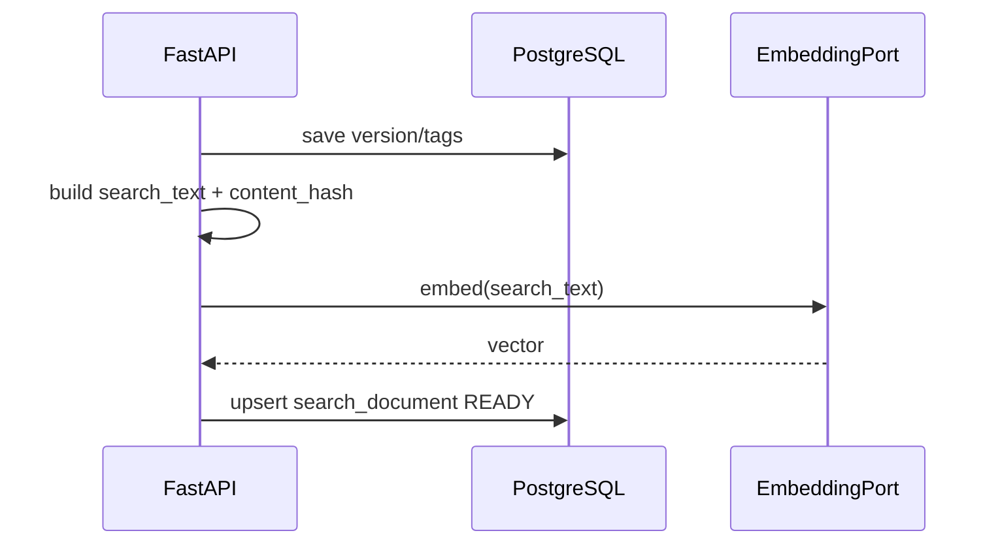

# 13 — RAG / Semantic Search và Filter Test Case

## 1. Mục tiêu

Luồng B cần hai khả năng song song:

1. **Filter chính xác** theo metadata.
2. **Tìm kiếm ngữ nghĩa** khi user mô tả scenario bằng ngôn ngữ tự nhiên.

Ví dụ user nhập:

```text
"Tìm các test case xe đang đi thì người đi bộ bất ngờ băng qua đường,
trời mưa và nguy hiểm cao"
```

Hệ thống cần tìm được case liên quan dù title/description không chứa đúng từng keyword.

## 2. Có thật sự cần “RAG” không?

Cho màn hình tìm Test Case, phần cốt lõi là **retrieval** của RAG:

```text
Query -> embedding -> retrieve TestCaseVersion -> ranked result
```

Không cần LLM sinh câu trả lời mới để trả danh sách test case.

Nếu sau này muốn chức năng:

```text
"Tại sao 5 test case này phù hợp?"
```

thì mới thêm generation step:

```text
retrieved cases -> LLM -> explanation
```

Vì vậy MVP nên triển khai **hybrid semantic retrieval**, tránh đưa LLM vào critical path không cần thiết.

## 3. Kiến trúc đề xuất



## 4. Structured filters luôn là nguồn sự thật

Các filter:

```text
map_code
ego_vehicle_code
adversary_type
environment_code
danger_level
status
creator_id
tag
```

phải đi qua SQL `WHERE`.

Ví dụ:

```sql
WHERE map_code = :map_code
  AND danger_level = :danger_level
  AND status = :status
```

Không dùng embedding để quyết định một record có `status=APPROVED` hay không.

## 5. Natural-language query

Request:

```json
{
  "query": "pedestrian suddenly crosses road in heavy rain",
  "filters": {
    "map_code": "Town05",
    "danger_level": ["HIGH", "CRITICAL"],
    "status": ["APPROVED"]
  },
  "page": 1,
  "page_size": 20
}
```

Rule:

- Filter do UI gửi là authoritative.
- Query parser không được override filter explicit.
- Query parser chỉ bổ sung constraint khi field chưa được user chọn.
- Nếu parser/LLM không có, search vẫn chạy với explicit filter + embedding query.

## 6. Search document được embed

Không embed raw `.xosc` toàn bộ ở MVP. Tạo text đại diện cho từng `test_case_version`:

```text
Title: Pedestrian crossing in heavy rain
Description: Pedestrian enters ego lane from sidewalk with short TTC.
Map: Town05
Ego vehicle: vehicle.tesla.model3
Adversary: pedestrian
Environment: heavy_rain
Danger level: HIGH
Tags: crossing, pedestrian, rain, occlusion
```

Hàm build document nằm ở application/domain-friendly service:

```python
def build_search_document(case, version, tags) -> str:
    ...
```

## 7. Database schema pgvector

Ví dụ nếu embedding model cho vector 768 chiều:

```sql
CREATE EXTENSION IF NOT EXISTS vector;

CREATE TABLE test_case_search_documents (
  version_id uuid PRIMARY KEY
    REFERENCES test_case_versions(id) ON DELETE CASCADE,
  search_text text NOT NULL,
  embedding vector(768),
  embedding_model text,
  embedding_status text NOT NULL DEFAULT 'PENDING'
    CHECK (embedding_status IN ('PENDING','READY','FAILED')),
  content_hash char(64) NOT NULL,
  indexed_at timestamptz,
  last_error text
);
```

> `768` chỉ là ví dụ. `EMBEDDING_DIM` phải khớp đúng model nhóm chọn trước khi tạo migration production.

HNSW cosine index:

```sql
CREATE INDEX idx_tc_search_embedding_hnsw
ON test_case_search_documents
USING hnsw (embedding vector_cosine_ops)
WHERE embedding_status = 'READY';
```

Structured indexes vẫn giữ riêng trên `test_case_versions`.

## 8. Indexing flow

Khi tạo/sửa DRAFT version:



Nếu embedding provider chậm, chuyển bước embed sang background job/outbox:

```text
version saved
 -> SEARCH_DOCUMENT_CHANGED event
 -> indexing worker
 -> embedding
 -> pgvector upsert
```

Search lúc đó eventual-consistent, nhưng filter SQL vẫn thấy record ngay lập tức.

## 9. Semantic query SQL

Ví dụ logic:

```sql
SELECT
  tc.id AS case_id,
  tc.case_key,
  tc.title,
  tcv.id AS version_id,
  tcv.version_no,
  tcv.status,
  tcv.map_code,
  tcv.adversary_type,
  tcv.environment_code,
  tcv.danger_level,
  1 - (sd.embedding <=> :query_embedding) AS semantic_score
FROM test_case_search_documents sd
JOIN test_case_versions tcv ON tcv.id = sd.version_id
JOIN test_cases tc ON tc.id = tcv.test_case_id
WHERE sd.embedding_status = 'READY'
  AND (:map_code IS NULL OR tcv.map_code = :map_code)
  AND (:status IS NULL OR tcv.status = :status)
  AND (:danger_level IS NULL OR tcv.danger_level = :danger_level)
ORDER BY sd.embedding <=> :query_embedding
LIMIT :limit OFFSET :offset;
```

Với nhiều filter/value, repository build SQL bằng SQLAlchemy thay vì string concatenate.

## 10. Hybrid keyword + semantic

Có thể hỗ trợ 3 mode:

```text
filter    -> chỉ metadata
keyword   -> PostgreSQL FTS + metadata
semantic  -> pgvector + metadata
hybrid    -> FTS + pgvector + metadata
```

Khuyến nghị UI mặc định:

```text
query trống       -> filter
query có text     -> hybrid
```

MVP hybrid có thể dùng Reciprocal Rank Fusion (RRF) để tránh phải tự chọn score scale chung giữa FTS và cosine similarity.

Pseudo:

```python
semantic = semantic_repo.search(...)
keyword = keyword_repo.search(...)
results = rrf_merge(keyword, semantic)
```

## 11. Clean Architecture

```text
Domain
  SearchCriteria
  SearchMode
  TestCaseSearchHit

Application
  SearchTestCasesUseCase
  ReindexTestCaseVersionUseCase
  BuildSearchDocumentService

Ports
  TestCaseSearchPort
  EmbeddingPort
  SemanticIndexPort

Infrastructure
  PostgresFilterRepository
  PostgresFullTextRepository
  PgVectorSemanticRepository
  <EmbeddingProviderAdapter>

Presentation
  /api/v1/test-cases/search
```

Domain không import `pgvector`, SQLAlchemy hay SDK của embedding provider.

## 12. API contract

### Unified search

```http
POST /api/v1/test-cases/search
```

Request:

```json
{
  "query": "cyclist cuts into ego lane at night",
  "mode": "hybrid",
  "filters": {
    "map_code": ["Town03", "Town05"],
    "status": ["APPROVED"],
    "danger_level": ["HIGH", "CRITICAL"]
  },
  "sort": "relevance",
  "page": 1,
  "page_size": 20
}
```

Response:

```json
{
  "items": [
    {
      "case_id": "...",
      "case_key": "TC-0007",
      "version_id": "...",
      "version_no": 2,
      "title": "Cyclist merge at night",
      "status": "APPROVED",
      "map_code": "Town05",
      "danger_level": "HIGH",
      "tags": ["cyclist", "night", "merge"],
      "score": 0.87,
      "matched_by": ["semantic", "filter"]
    }
  ],
  "page": 1,
  "page_size": 20,
  "total": 6
}
```

Không expose raw embedding ra frontend.

## 13. Frontend UX

Trang `/test-cases`:

```text
┌──────────────────────────────────────────────────────┐
│ Search: [ pedestrian suddenly crosses in rain    ]  │
│                                                      │
│ Map [Town05]  Adversary [Any]  Danger [HIGH]        │
│ Env [Any]     Status [APPROVED] Creator [Any]       │
│                                                      │
│ 6 results                                            │
│ TC-001 Pedestrian crossing in rain     score 0.91    │
│ TC-014 Occluded pedestrian from bus    score 0.86    │
└──────────────────────────────────────────────────────┘
```

Filter state nên nằm trên URL để share/reload được.

Ví dụ:

```text
/test-cases?q=pedestrian+rain&map=Town05&danger=HIGH&status=APPROVED
```

Semantic score chỉ dùng để ranking; không nên thể hiện như “độ đúng 91%” nếu UI không giải thích rõ ý nghĩa.

## 14. Re-index

Cần Admin command/API:

```http
POST /api/v1/admin/search/reindex
POST /api/v1/admin/search/reindex/{version_id}
```

Dùng khi:

- đổi embedding model;
- đổi `build_search_document`;
- embedding lỗi;
- migrate vector dimension.

Nên version hóa:

```text
embedding_model
content_hash
indexed_at
```

để biết record nào stale.

## 15. Permission và security

Search result phải áp dụng cùng permission rule như list bình thường.

Không được:

```text
vector search -> trả hidden/archived/private record -> frontend tự hide
```

Phải:

```text
authorization scope
 + structured filters
 + vector ranking
 -> result
```

## 16. Fallback

Nếu embedding provider hoặc pgvector path lỗi:

```text
semantic unavailable
 -> FTS + structured filters
```

UI vẫn dùng được chức năng chính.

## 17. Test cases cho search engine

Tối thiểu test:

1. explicit `status=APPROVED` không bao giờ trả DRAFT dù semantic score cao;
2. filter Town05 chỉ trả Town05;
3. query "person crossing" tìm được test case dùng từ "pedestrian";
4. query "bike cuts in" tìm được cyclist merge;
5. record chưa có embedding vẫn tìm được bằng filter/keyword;
6. user không có quyền không nhìn thấy record qua semantic endpoint;
7. đổi metadata làm search document stale và được re-index;
8. pagination ổn định.

Mock data để kiểm thử nằm ở `14-mock-test-case-data.md`.
