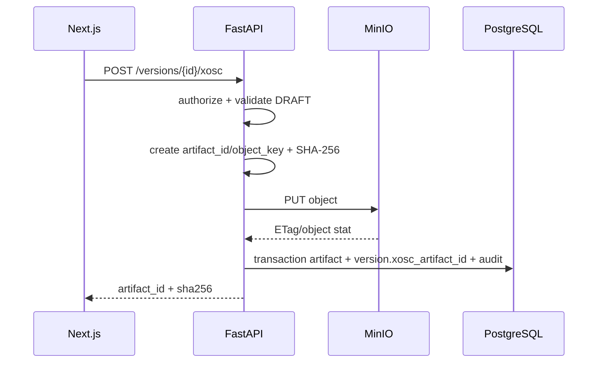
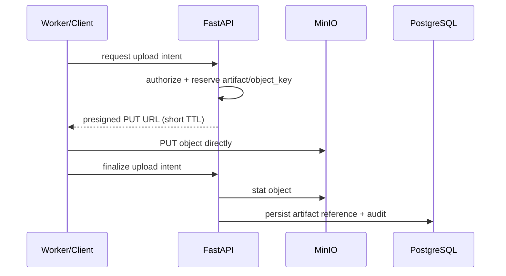

# 15 — MinIO Object Storage cho Luồng B

## 1. MinIO dùng để làm gì?

MinIO là object storage tương thích API S3. Trong Scenario Forge, nó **không thay PostgreSQL**. Hai thành phần có vai trò khác nhau:

```text
PostgreSQL                         MinIO
------------------------------    -----------------------------
TestCase/TestCaseVersion          file .xosc
Review/Approval                    run logs
RunResult metadata                screenshots
Audit log                         videos
Artifact reference                suite export .zip
```

DB lưu `bucket_name + object_key + checksum`; MinIO giữ bytes thực tế.

## 2. Clean Architecture

```text
Use Case
   |
   v
StoragePort  <---------------- interface/application port
   ^
   |
MinioStorageAdapter ---------- infrastructure
   |
   v
MinIO S3 API
```

Nếu sau này đổi sang AWS S3, application/domain không cần đổi.

## 3. Bucket strategy

MVP nên dùng một private bucket:

```text
scenario-forge-artifacts
```

Tách namespace bằng prefix:

```text
xosc/...
runs/...
exports/...
```

Không cần tạo bucket theo từng user/test case vì khó quản lý policy/lifecycle.

## 4. Immutable object key

Đề xuất:

```text
xosc/{test_case_id}/{version_id}/{artifact_id}.xosc
runs/{run_job_id}/logs/{artifact_id}.log
runs/{run_job_id}/video/{artifact_id}.mp4
```

`artifact_id` là UUID do Backend sinh. `original_name` không dùng làm locator.

Lợi ích:

- không collision tên file;
- không path traversal;
- dễ audit;
- replace file không phá artifact cũ;
- TestCaseVersion/RunResult vẫn reproducible.

## 5. Upload flow cho XOSC



Nếu DB fail sau PUT, Backend cleanup object bằng compensating action.

## 6. Presigned upload cho file lớn

Video/log từ Worker có thể lớn. Không cần truyền toàn bộ bytes qua FastAPI:



Presigned URL chỉ là quyền tạm thời cho một object cụ thể. Nếu client nằm ngoài Docker network, URL phải được ký bằng hostname/base URL mà client truy cập được; `minio:9000` chỉ hợp lệ giữa các container trong cùng network.

## 7. Download flow

Hai lựa chọn:

### A. Stream qua Backend

Phù hợp `.xosc`/log nhỏ, đơn giản về RBAC.

### B. Presigned GET

Phù hợp video/zip lớn:

```text
Client -> FastAPI authorize -> presigned GET -> MinIO
```

Không đặt bucket thành public.

## 8. Artifact schema

```text
id
kind
storage_provider = MINIO
bucket_name
object_key
etag
original_name
content_type
size_bytes
sha256
created_by
created_at
deleted_at
metadata
```

Không dùng ETag thay cho SHA-256 vì semantics ETag có thể thay đổi theo cách upload/backend.

## 9. Security

Development có thể dùng root credential trong Docker Compose. Production nên:

- tạo credential/service account riêng cho Backend;
- quyền tối thiểu trên bucket/prefix cần thiết;
- giữ bucket private;
- TLS khi chạy qua network không tin cậy;
- không expose port 9000 trực tiếp ra Internet;
- không log access key, secret key hay full presigned URL;
- rotate credential định kỳ.

## 10. Docker data persistence

```text
minio container
    |
    v
/data
    |
    v
minio_data Docker named volume
```

Restart/recreate container vẫn giữ data nếu volume còn. Nhưng Docker volume **không phải backup**.

## 11. Backup

Để restore đầy đủ Scenario Forge cần backup đồng bộ:

```text
PostgreSQL metadata
+
MinIO object data
```

Chỉ backup một bên sẽ tạo dangling references hoặc orphan objects.

## 12. Khi nào MinIO bị lỗi?

Backend map lỗi storage thành `StorageUnavailable`/503.

- Search/filter/review có thể tiếp tục nếu không cần đọc object.
- Upload/download artifact bị chặn rõ ràng.
- Không insert artifact row nếu object chưa persist thành công.
- Run finalize có thể retry nếu artifact là thành phần bắt buộc.

## 13. Boundary với Luồng A

Worker WebSocket vẫn thuộc Luồng A. Luồng B chỉ cung cấp contract để Worker:

- nhận `xosc` qua authorized download/presigned GET;
- xin upload intent/presigned PUT cho log/video;
- finalize artifact + RunResult.

Do đó thêm MinIO **không kéo CARLA/Worker implementation vào Luồng B**.
