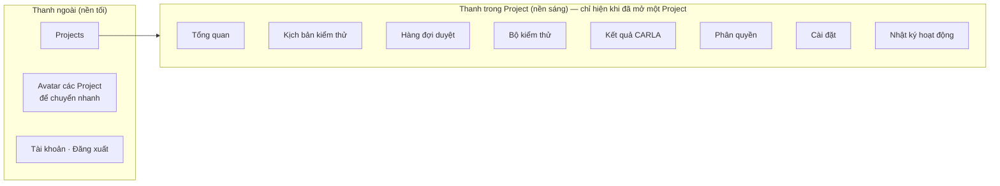
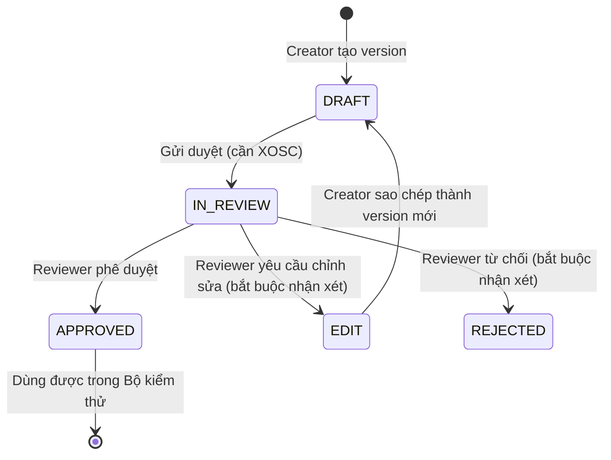

# 16 — Phân quyền và các màn hình theo vai trò

Tài liệu này mô tả **ai được làm gì, ở màn nào** trong Scenario Forge. Mọi quy tắc đều được backend kiểm tra; frontend chỉ ẩn những nút người dùng không có quyền bấm. Chi tiết kỹ thuật về bảng dữ liệu và migration nằm ở [06 — Authentication, RBAC và Approval Workflow](06-auth-rbac-approval.md).

## 1. Ba khái niệm cần nắm

Quyền của một người được tính **riêng trong từng Project**. Cùng một người có thể là Quản trị viên ở Project A nhưng chỉ là Thành viên ở Project B.

| Khái niệm | Giá trị | Quyết định điều gì |
|---|---|---|
| **Vai trò (Role)** | Quản trị viên (`ADMIN`), Thành viên (`MEMBER`) | Quyền quản trị Project: thêm/xóa người, giao nhiệm vụ, sửa Project, xem nhật ký |
| **Nhiệm vụ (Responsibility)** | Tạo test case, Duyệt test case, Tự duyệt test case của mình | Quyền làm việc với kịch bản: tạo, gửi duyệt, duyệt |
| **Người tạo Project** | Người bấm "Tạo Project" | Luôn là Quản trị viên, không bị xóa hay hạ vai trò, là người duy nhất được xóa Project |

Hai điểm hay bị hiểu nhầm:

- **Quản trị viên không tự có nhiệm vụ.** Admin muốn tạo hoặc duyệt kịch bản cũng phải được giao nhiệm vụ như mọi người.
- **"Tự duyệt" chỉ có hiệu lực khi đã có "Duyệt".** Khi giao nhiệm vụ, tick "Tự duyệt" sẽ tự tick thêm "Duyệt"; bỏ "Duyệt" sẽ bỏ luôn "Tự duyệt".

Trong tài liệu, **Creator** là người có nhiệm vụ *Tạo test case*, **Reviewer** là người có nhiệm vụ *Duyệt test case*. Một người có thể vừa là Creator vừa là Reviewer.

## 2. Bảng quyền

| Quyền | Mọi thành viên | Quản trị viên | Người tạo Project | Nhiệm vụ Tạo | Nhiệm vụ Duyệt | Nhiệm vụ Tự duyệt |
|---|:-:|:-:|:-:|:-:|:-:|:-:|
| Xem kịch bản, bộ kiểm thử, kết quả chạy | ✓ | | | | | |
| Chạy bộ kiểm thử, hủy lượt chạy, xuất bộ kiểm thử | ✓ | | | | | |
| Xem danh sách phân quyền | ✓ | | | | | |
| Dùng màn Cài đặt (bản demo) | ✓ | | | | | |
| Thêm/xóa thành viên, đổi vai trò, giao nhiệm vụ | | ✓ | | | | |
| Sửa tên, mô tả Project | | ✓ | | | | |
| Xem Nhật ký hoạt động | | ✓ | | | | |
| Xóa Project | | | ✓ | | | |
| Tạo kịch bản, tạo/sao chép version, gửi duyệt | | | | ✓ | | |
| Tạo, sửa, xóa bộ kiểm thử và danh sách case trong bộ | | | | ✓ | | |
| Xem hàng đợi duyệt, nhận xét, ra quyết định | | | | | ✓ | |
| Duyệt kịch bản do chính mình tạo | | | | | ✓ (cần thêm) | ✓ |

Quyền thực tế của một người = quyền chung + quyền của vai trò + quyền của từng nhiệm vụ (+ quyền xóa Project nếu là người tạo). Backend trả sẵn danh sách này cho frontend, nên menu và nút bấm luôn khớp với quyền thật.

## 3. Quy tắc quản lý thành viên

| Hành động | Ai làm được | Giới hạn |
|---|---|---|
| Tạo Project mới | Bất kỳ ai đã đăng nhập | Người tạo tự động là Quản trị viên với đủ 3 nhiệm vụ |
| Thêm người bằng email | Quản trị viên | Email chưa có tài khoản sẽ được tạo ở trạng thái "Chưa đăng ký"; người đó đăng ký bằng đúng email này |
| Đổi vai trò | Quản trị viên | Không ai đổi được vai trò của người tạo Project. Quản trị viên khác được tự hạ mình xuống Thành viên |
| Giao/sửa nhiệm vụ | Quản trị viên | Áp dụng cho mọi người, kể cả chính mình và người tạo Project |
| Xóa người khỏi Project | Quản trị viên | Không xóa chính mình (dùng "Rời Project"), không xóa người tạo Project |
| Rời Project | Mọi thành viên | Trừ người tạo Project |
| Sửa tên, mô tả Project | Quản trị viên | Mã Project không đổi |
| Xóa Project | Chỉ người tạo Project | Xóa mềm: Project biến mất với mọi người nhưng dữ liệu và nhật ký vẫn được giữ |

Mọi thay đổi vai trò, nhiệm vụ, thêm/xóa/rời đều được ghi vào Nhật ký hoạt động.

## 4. Bố cục điều hướng

Đầu thanh trong Project có tên Project, vai trò của bạn, và nút **⋯** để Chỉnh sửa / Rời / Xóa Project ngay tại chỗ (tùy quyền).

### Menu mỗi người thấy

| Mục menu | Thành viên chưa có nhiệm vụ | Creator | Reviewer | Quản trị viên |
|---|:-:|:-:|:-:|:-:|
| Tổng quan | ✓ | ✓ | ✓ | ✓ |
| Kịch bản kiểm thử | ✓ | ✓ | ✓ | ✓ |
| Hàng đợi duyệt | | ✓ (chỉ đọc, bản của mình) | ✓ | theo nhiệm vụ |
| Bộ kiểm thử | ✓ | ✓ | ✓ | ✓ |
| Kết quả CARLA | ✓ | ✓ | ✓ | ✓ |
| Phân quyền | ✓ (chỉ xem) | ✓ (chỉ xem) | ✓ (chỉ xem) | ✓ (xem và sửa) |
| Cài đặt | ✓ | ✓ | ✓ | ✓ |
| Nhật ký hoạt động | | | | ✓ |

Nút **"Tạo kịch bản"** trên thanh trên cùng chỉ hiện với Creator.

## 5. Chi tiết từng màn

### 5.1. Đăng nhập, Đăng ký

Ai cũng vào được. Người được Quản trị viên mời bằng email sẽ hoàn tất đăng ký bằng đúng email đó và thấy ngay Project đã được mời.

### 5.2. Projects (thanh ngoài)

Danh sách các Project bạn đang tham gia, có tìm kiếm và nút **Tạo Project** (ai cũng tạo được). Bấm vào thẻ để mở Project. Nút **⋯** trên mỗi thẻ hiện tùy chọn theo vai trò **trong Project đó**:

| Vai trò của bạn trong Project | Tùy chọn |
|---|---|
| Người tạo | Chỉnh sửa, Xóa Project |
| Quản trị viên | Chỉnh sửa, Rời Project |
| Thành viên | Rời Project |

Xóa và Rời đều có hộp xác nhận.

### 5.3. Tổng quan

| Phần | Nội dung | Ai thấy |
|---|---|---|
| Nút chính | Creator: "Tạo kịch bản". Reviewer (không có nhiệm vụ Tạo): "Mở hàng đợi duyệt" | Theo nhiệm vụ |
| Số liệu catalog | Số kịch bản, số đã duyệt, số đang chờ duyệt, số bộ kiểm thử | Mọi người |
| **Việc cần xử lý** | Chờ Reviewer quyết định · Cần chỉnh sửa · Đã duyệt nhưng chưa vào bộ kiểm thử · Đã vào bộ nhưng chưa có kết quả chạy. Bấm thẻ để mở đúng màn | Reviewer thấy số của **toàn Project**; người khác chỉ thấy số của **kịch bản mình tạo** (hai thẻ đầu) |
| Đi đến công việc | 01 Tạo bản nháp (chỉ Creator) · 02 Chạy và xem kết quả · 03 Review bằng chứng · 04 Tìm bản đã duyệt · 05 Bộ kiểm thử | Theo nhiệm vụ |
| Môi trường CARLA | Trạng thái lấy từ màn Cài đặt (bản demo) | Mọi người |

### 5.4. Kịch bản kiểm thử

| Thao tác | Ai làm được |
|---|---|
| Xem danh sách, lọc, tìm kiếm (kể cả tìm bằng câu mô tả), xem chi tiết, tải tệp XOSC | Mọi thành viên |
| Tạo kịch bản mới | Creator |
| Sửa tên, mô tả kịch bản | Chỉ người đã tạo kịch bản đó |
| Sửa version bản nháp, tải lên tệp XOSC | Người tạo version (cần nhiệm vụ Tạo). Quản trị viên sửa được bản nháp của người khác |
| Tạo version mới, sao chép version | Creator |
| Gửi duyệt | Chỉ người tạo version, cần nhiệm vụ Tạo; version phải là bản nháp và đã có tệp XOSC |

Vòng đời một version:

Chỉ bản nháp mới sửa được. Version đã duyệt không đổi nữa; muốn thay đổi thì tạo version mới.

### 5.5. Hàng đợi duyệt

Màn này có hai chế độ tùy nhiệm vụ.

| | Reviewer | Creator không có nhiệm vụ Duyệt |
|---|---|---|
| Tab "Chờ duyệt" | Mọi version đang chờ trong Project | Chỉ những version **mình đã gửi** ("Đã gửi, chờ quyết định") |
| Mỗi thẻ hiển thị | Kịch bản, người gửi, metadata, trạng thái XOSC, **bằng chứng chạy** (kết luận, va chạm, TTC, số lượt chạy), các nhận xét | Như bên trái |
| Thêm nhận xét | ✓ | Không |
| Yêu cầu chỉnh sửa / Từ chối / Phê duyệt | ✓ (yêu cầu sửa và từ chối bắt buộc có nhận xét) | Không, chỉ thấy dòng "Đang chờ Reviewer quyết định" |
| Tab "Lịch sử quyết định" | Mọi quyết định trong Project: version, quyết định, lý do, người duyệt, thời điểm, bằng chứng | Chỉ quyết định cho bản mình gửi |
| Tìm kiếm, phân trang 25/50/100 | ✓ | ✓ |

**Duyệt bản của chính mình:** Reviewer chỉ phê duyệt / từ chối / yêu cầu sửa được version do chính mình tạo khi có thêm nhiệm vụ *Tự duyệt*. Không có nhiệm vụ đó, thẻ hiện dòng "Bạn chưa được giao nhiệm vụ tự duyệt test case của mình".

Thành viên không có nhiệm vụ Tạo lẫn Duyệt không thấy màn này.

### 5.6. Bộ kiểm thử

| Thao tác | Ai làm được |
|---|---|
| Xem danh sách bộ, chi tiết bộ, lịch sử các lượt chạy | Mọi thành viên |
| Chạy bộ kiểm thử, xuất bộ kiểm thử | Mọi thành viên |
| Tạo, sửa, xóa bộ; thêm, bỏ, sắp xếp case trong bộ | Creator |

Một bộ kiểm thử **chỉ nhận version đã được duyệt** (cả backend lẫn database đều chặn), nên kết quả chạy luôn gắn với đúng version đã duyệt.

### 5.7. Kết quả CARLA

Mọi thành viên xem được danh sách kết quả chạy, lọc theo kết luận, và xem chi tiết lượt chạy. Mọi thành viên hủy được lượt chạy đang xếp hàng hoặc đã được nhận (có hộp xác nhận).

### 5.8. Phân quyền

| Thao tác | Ai làm được |
|---|---|
| Xem danh sách thành viên, vai trò, nhiệm vụ | Mọi thành viên |
| **Thêm thành viên** (modal: email, vai trò, nhiệm vụ) | Quản trị viên |
| **Chỉnh sửa phân quyền** (modal: vai trò, nhiệm vụ) | Quản trị viên. Ô vai trò của người tạo Project bị khóa |
| Xóa thành viên (có hộp xác nhận) | Quản trị viên. Không hiện nút với chính mình và người tạo Project |

### 5.9. Cài đặt (bản demo)

Mọi thành viên dùng được. Màn ghi rõ **"Bản demo giao diện"**: các bước chạy bằng dữ liệu mô phỏng trong trình duyệt, chưa kết nối CARLA hay worker thật, và trạng thái lưu riêng theo từng Project trên máy người dùng.

- Chọn nguồn dữ liệu: dữ liệu mặc định hoặc catalog đã đồng bộ.
- Kết nối CARLA theo 4 bước: chuẩn bị CARLA → tạo mã ghép nối → kiểm tra CARLA → xác nhận chia sẻ và đồng bộ catalog.
- Trạng thái máy chạy (worker, CARLA, catalog) và thông tin kỹ thuật.
- Thông tin tài khoản: tên, email, vai trò và nhiệm vụ trong Project.

Trạng thái này cũng hiện ở chip trên thanh trên cùng và ở thẻ "Môi trường CARLA" của Tổng quan.

### 5.10. Nhật ký hoạt động

Chỉ Quản trị viên xem được. Nhật ký chỉ ghi các hành động **làm thay đổi dữ liệu** (không ghi đăng nhập hay mở Project) và không ai sửa hay xóa được.

Mỗi dòng gồm thời gian, người thực hiện (tên và email, hoặc "Hệ thống" nếu là máy chạy mô phỏng tự động), hoạt động bằng tiếng Việt, đối tượng liên quan, và nút "Xem chi tiết" hiện bảng *Trước / Sau*. Có bộ lọc theo hoạt động và theo loại đối tượng.

## 6. Ví dụ theo từng người

**An — người tạo Project "Kiểm thử VF8".** Là Quản trị viên, có đủ 3 nhiệm vụ. Làm được mọi thứ: tạo và duyệt kịch bản (kể cả của mình), quản lý thành viên, xem nhật ký, sửa và xóa Project. Không thể rời Project hay bị ai hạ vai trò.

**Bình — Quản trị viên, chưa được giao nhiệm vụ.** Quản lý được thành viên và xem nhật ký, nhưng **không tạo hay duyệt kịch bản được** cho tới khi tự giao hoặc được giao nhiệm vụ. Có thể tự hạ mình xuống Thành viên hoặc rời Project.

**Chi — Thành viên, nhiệm vụ Tạo.** Tạo kịch bản, gửi duyệt, quản lý bộ kiểm thử. Ở Hàng đợi duyệt chỉ thấy bản mình đã gửi và lịch sử quyết định cho mình. Không duyệt được.

**Dũng — Thành viên, nhiệm vụ Duyệt.** Xem toàn bộ hàng đợi, nhận xét, phê duyệt / yêu cầu sửa / từ chối. Không tạo kịch bản, không tạo bộ kiểm thử, nhưng vẫn chạy được bộ kiểm thử có sẵn.

**Em — Thành viên, chưa có nhiệm vụ.** Chỉ xem: kịch bản, bộ kiểm thử, kết quả chạy, danh sách phân quyền, Cài đặt. Vẫn chạy được bộ kiểm thử. Không thấy Hàng đợi duyệt và Nhật ký hoạt động.

## 7. Phần chưa có trong hệ thống

- Màn **Cài đặt** chỉ là bản demo giao diện; backend chưa có API ghép worker bằng mã.
- Màn **Tạo scenario bằng Agent** (theo prototype) chưa làm; hiện tạo kịch bản thủ công kèm tệp XOSC.
- Reviewer **không bắt buộc** phải có lượt chạy hợp lệ mới được duyệt, vì hệ thống chỉ cho chạy version đã duyệt.
