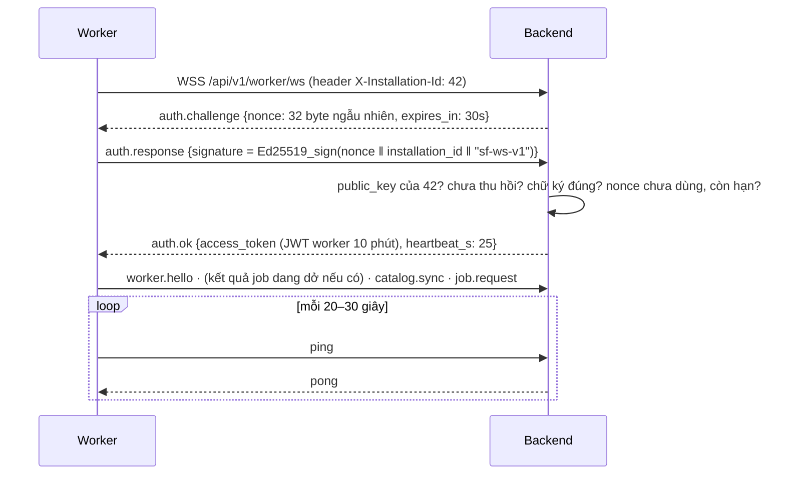
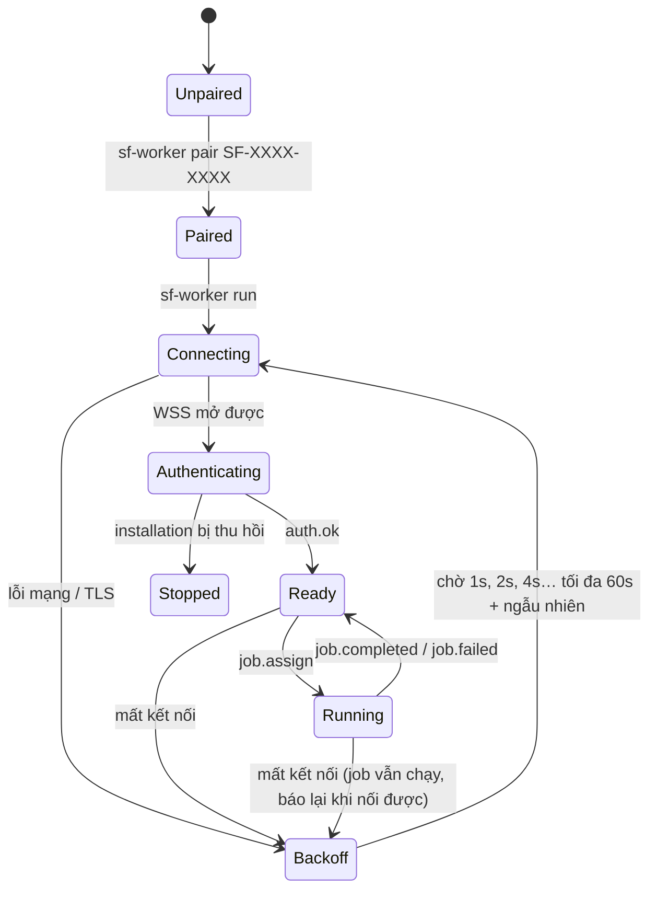
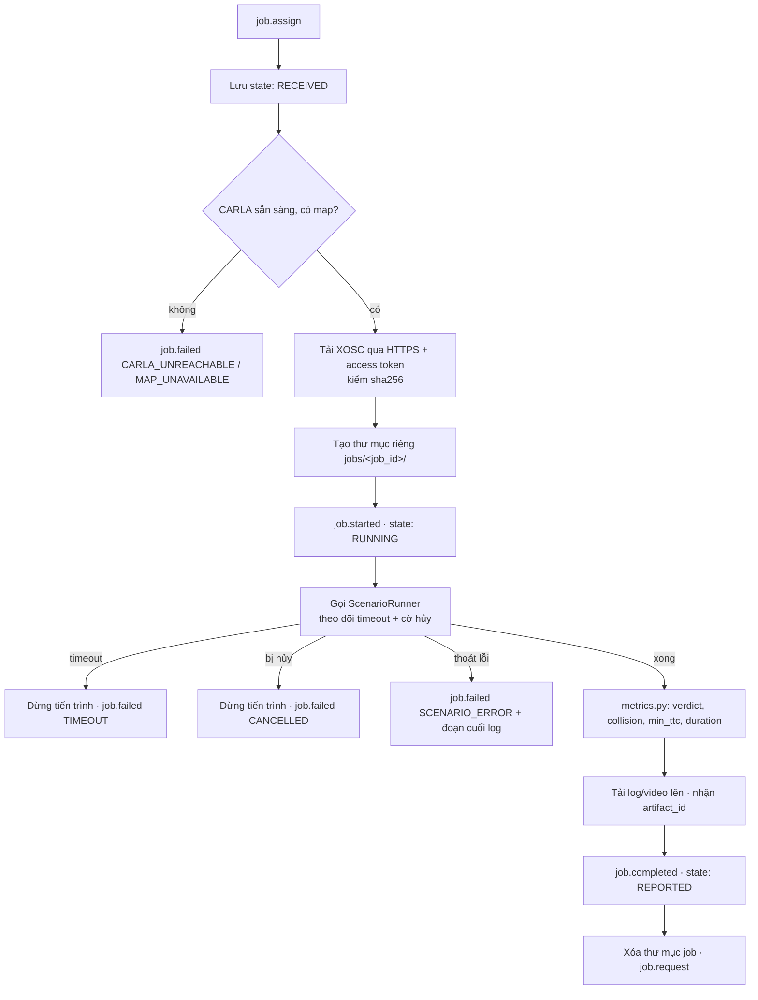

# 18 — Worker CARLA và kết nối với production trên VPS

> **Cập nhật:** giao thức chạy test case qua Bridge (`run.assign` / `job.*` / `run.completed`) đã triển khai ở backend theo [doc 21](21-simulator-runner-bridge.md), thay cho các message `job.*` ở §4.2.
>
> **Trạng thái: thiết kế, chưa triển khai.** Mục "Hiện trạng" mô tả code đang có trong repo; các mục còn lại là đề xuất. Những chỗ ghi **[Chưa kiểm chứng]** dựa trên hiểu biết về thư viện/công cụ bên ngoài, cần đối chiếu với đúng phiên bản trước khi làm.

Tài liệu mô tả cách một **worker** chạy trên máy khách (cạnh CARLA) kết nối an toàn tới hệ thống Scenario Forge chạy trên **VPS**, nhận job, chạy ScenarioRunner và gửi kết quả về.

Trong tài liệu, `<domain>` là tên miền production (ví dụ `app.scenarioforge.vn`), trỏ bản ghi DNS loại A về IP public của VPS.

---

## 1. Kiến trúc

```
Máy khách (sau NAT/firewall)                VPS (Docker Compose) — chỉ mở 22, 80, 443
┌──────────────────────────┐                ┌─────────────────────────────────────────────┐
│ Scenario Forge Worker    │ wss://<domain>/│ Caddy :443 (TLS tự động)                    │
│  ├─ CARLA Python API     │─ api/v1/───────▶│  ├─ /api/* ──▶ backend:8000 (1 tiến trình)  │
│  └─ ScenarioRunner       │  worker/ws     │  │             ├─ postgres:5432 (nội bộ)     │
│                          │◀─ job.assign ──│  │             │   dữ liệu + XOSC + log      │
│                          │─ job.completed▶│  │             └─ volume /data/artifacts     │
│                          │─ POST file ───▶│  │                 (video, ảnh)              │
└──────────────────────────┘                │  └─ /*     ──▶ frontend:3000                │
                                            │ migrate (chạy 1 lần mỗi lần deploy)         │
                                            └─────────────────────────────────────────────┘
Người dùng (trình duyệt) ──https://<domain>──▶ Caddy
```

Nguyên tắc:

- **Toàn bộ chạy trên VPS**, không dùng Render, không dùng MinIO. Postgres và backend không mở cổng ra Internet; chỉ Caddy nghe 80/443.
- **Worker luôn chủ động kết nối ra ngoài** (`wss://` cổng 443) — máy khách sau NAT/firewall không cần mở cổng nào.
- **Điều khiển và tín hiệu sống đi qua WebSocket; file đi qua HTTPS** tới backend.
- **Chung một domain:** `/` cho frontend, `/api/*` cho backend (gồm cả WebSocket worker), nên không cần CORS.

### Lưu file (không có MinIO)

| Loại file | Kích thước thường gặp | Lưu ở đâu |
|---|---|---|
| XOSC | Vài KB | Postgres (`artifacts.content`, như hiện tại) |
| Log, báo cáo JSON | Vài KB – vài MB | Postgres |
| Video, ảnh chụp | Hàng chục – hàng trăm MB | Ổ đĩa VPS `/data/artifacts/...` (Docker volume); Postgres chỉ lưu đường dẫn, sha256, kích thước |

Video không để trong Postgres vì DB và `pg_dump` phình nhanh, giá trị `bytea` phải nạp hết vào RAM khi đọc/ghi. Video chỉ tải về qua API có kiểm tra quyền Project; Caddy không phục vụ thư mục này trực tiếp.

---

## 2. Hiện trạng trong repo

| Đã có | Còn thiếu / cần sửa |
|---|---|
| WebSocket `/api/v1/integration/worker/ws` nhận `worker.hello`, `job.next`, `worker.heartbeat` | Backend không chủ động đẩy job; kết quả chỉ gửi được qua REST |
| REST `jobs/next`, `started`, `completed`, `failed` (xử lý gửi trùng) | Worker chưa tải được XOSC (API tải hiện đòi token người dùng) |
| Xác thực bằng **một** `WORKER_SERVICE_TOKEN` dùng chung, truyền qua `?token=` trên URL | **Lỗ hổng:** `claim_next` lấy job của **mọi Project** — worker của khách A nhận được job của khách B |
| Bảng `run_jobs`, `run_results`, `artifacts` | Chưa có ghép bằng mã, installation, catalog CARLA, trạng thái máy chạy (màn Cài đặt hiện là demo) |
| `docker-compose.yml` có Postgres pgvector, service `migrate` | Compose đang mở `5432` và `8000` ra ngoài — phải bỏ khi lên VPS |

---

## 3. Luồng đầu–cuối

### 3.1. Ghép nối (một lần cho mỗi máy CARLA)

```mermaid
sequenceDiagram
    participant A as Admin (trình duyệt)
    participant S as Backend
    participant W as Worker (máy khách)
    A->>S: POST /projects/{id}/worker-installations/pair-code (JWT, cần member:manage)
    S-->>A: SF-7K2Q-M9XD (DB lưu sha256, hết hạn 10 phút, dùng 1 lần)
    Note over W: Sinh cặp khóa Ed25519; khóa riêng lưu file quyền 600
    W->>S: POST /api/v1/worker/pair {code, public_key, machine_name, versions}
    S->>S: hash(code) tồn tại? chưa dùng? chưa hết hạn? số lần thử sai < 5?
    S-->>W: {installation_id, project_id}
    S->>S: Đánh dấu mã đã dùng, lưu public_key, ghi Nhật ký hoạt động
```

### 3.2. Kết nối và xác thực WebSocket



Quá vài nhịp không có ping, backend đánh dấu installation `offline`; màn Cài đặt hiện đúng trạng thái.

### 3.3. Giao và chạy job

1. Người dùng bấm **Chạy** một bộ kiểm thử → backend tạo `run_jobs` `QUEUED` trong Project đó.
2. Worker gửi `job.request` (hoặc backend tự đẩy khi worker online) → backend chọn job **cùng Project với installation** (`FOR UPDATE SKIP LOCKED`), gắn `worker_installation_id`, chuyển `CLAIMED`, gửi `job.assign`.
3. Worker tải XOSC bằng access token ngắn hạn, gửi `job.started`, gọi ScenarioRunner trên CARLA của máy khách.

### 3.4. Trả kết quả

```
Worker ──POST /api/v1/worker/jobs/{job_id}/artifacts (multipart, Bearer access_token)──▶ backend
backend: token hợp lệ? job thuộc installation này? loại & kích thước file cho phép?
         → file nhỏ: ghi artifacts.content
         → video: tạo dòng artifacts trước để lấy artifact_id (BIGINT),
                  rồi ghi stream xuống /data/artifacts/{project_id}/{job_id}/{artifact_id}.mp4, tính sha256 khi ghi
         → trả artifact_id
Worker ──job.completed {verdict, metrics, exit_code, duration_ms, artifacts:[{id, sha256}]}──▶ backend (WS)
```

Backend ghi `run_results`, cập nhật trạng thái bộ kiểm thử và Nhật ký hoạt động; kết quả hiện ở **Kết quả CARLA** và làm bằng chứng ở **Hàng đợi duyệt**.

### 3.5. Hủy, mất kết nối, thu hồi

| Tình huống | Xử lý |
|---|---|
| Người dùng hủy | Backend gửi `job.cancel` → worker dừng ScenarioRunner → `job.failed` mã `CANCELLED` |
| Worker mất mạng | Worker tự kết nối lại (chờ tăng dần 1s, 2s, 4s… tối đa 60s, cộng ngẫu nhiên); job quá thời gian ở `CLAIMED/RUNNING` được trả về hàng đợi nếu `attempt < max_attempts` |
| Worker bị tắt giữa job | Khi chạy lại, gửi `job.failed` mã `WORKER_RESTARTED` cho mọi job chưa báo cáo |
| Admin thu hồi installation | Backend đóng WebSocket, từ chối mọi request của installation đó ngay lập tức |

---

## 4. Giao thức WebSocket

### 4.1. Định danh: chỉ dùng BIGINT

Giống toàn hệ thống, **mọi id trong giao thức là số nguyên `BIGINT` tự tăng do Postgres cấp, không dùng UUID**: `installation_id`, `project_id`, `job_id`, `artifact_id`, `run_result_id`. Trong JSON, các id này là số (`42`), không phải chuỗi.

Để chống gửi trùng, mỗi message mang **`seq`** — số thứ tự `BIGINT` tăng dần, tính riêng cho từng installation và từng chiều:

| Chiều | Ai cấp `seq` | Lưu ở đâu | Quy tắc |
|---|---|---|---|
| Worker → Server | Worker, bắt đầu từ 1, mỗi message +1 | File trạng thái của worker (để tiếp tục sau khi khởi động lại) và `worker_installations.last_inbound_seq` trên server | Server chỉ xử lý message có `seq > last_inbound_seq`; `seq` cũ hơn là bản gửi lại → trả `ack` lần nữa, **không** xử lý lại |
| Server → Worker | Server, tăng `worker_installations.last_outbound_seq` | DB | Worker ghi nhận `seq` lớn nhất đã xử lý, bỏ qua bản trùng |

- Message của worker nằm trong hàng chờ gửi (outbox) **cho tới khi nhận `ack` có đúng `seq`**. Đứt kết nối thì gửi lại theo đúng thứ tự, nên `seq` luôn tăng trên một kết nối.
- Server cập nhật `last_inbound_seq` **trong cùng transaction** với thay đổi do message gây ra (ví dụ ghi `run_results`), sau `SELECT … FOR UPDATE` dòng installation. Vì vậy một message hoặc được xử lý trọn vẹn đúng một lần, hoặc chưa được xử lý.
- `ping`/`pong` dùng cơ chế ping của chính WebSocket, không mang `seq`.
- Ghép lại (installation mới) thì `seq` bắt đầu lại từ 1.

```python
# Server — xử lý một message của worker, chống trùng bằng seq BIGINT
async def handle_worker_message(installation_id: int, message: dict, websocket) -> None:
    seq = int(message["seq"])
    async with SessionFactory() as session:
        installation = await session.get(WorkerInstallation, installation_id, with_for_update=True)
        if seq <= installation.last_inbound_seq:
            await websocket.send_json({"type": "ack", "seq": seq, "duplicate": True})
            return
        await apply_message(session, installation, message)   # job.completed → run_results, ...
        installation.last_inbound_seq = seq
        await session.commit()
    await websocket.send_json({"type": "ack", "seq": seq})
```

### 4.2. Các loại message

Mỗi message là JSON có `type` và `seq` (trừ `ack`, `ping`/`pong`).

| Chiều | `type` | Nội dung |
|---|---|---|
| S → W | `auth.challenge` | `nonce`, `expires_in` |
| W → S | `auth.response` | `signature` |
| S → W | `auth.ok` / `auth.token` | `access_token`, `expires_in`, `heartbeat_s` |
| W → S | `auth.refresh` | Xin access token mới trước khi hết hạn |
| W → S | `worker.hello` | `worker_version`, `capabilities` (`slots`) |
| W ↔ S | `ping` / `pong` | Mỗi 20–30 giây |
| W → S | `catalog.sync` | `carla_version`, `current_map`, `maps`, `vehicles`, `walkers`, `content_hash` — **đề xuất mới:** chỉ gửi tóm tắt + hash; catalog.v1 đầy đủ (spawn point, waypoint) gửi qua HTTPS, xem [doc 19 §7](19-agent-sinh-kich-ban.md) |
| S → W | `catalog.ack` *(đề xuất)* | `content_hash`, `known` — `false` thì worker gửi catalog.v1 qua `POST /api/v1/worker/catalog-snapshots` |
| S → W | `catalog.request` | Yêu cầu đọc lại CARLA |
| W → S | `job.request` | `slots` còn trống |
| S → W | `job.assign` | `job_id`, `attempt`, `map_code`, `timeout_s`, `xosc_sha256` |
| W → S | `job.rejected` | `job_id`, `reason` (`BUSY`, `MAP_UNAVAILABLE`) |
| W → S | `job.started` / `job.progress` | `job_id`, tiến độ |
| W → S | `job.completed` | `job_id`, `verdict`, `metrics`, `exit_code`, `duration_ms`, `artifacts` |
| W → S | `job.failed` | `job_id`, `error_code`, `error_message` |
| S → W | `job.cancel` | `job_id` |
| S → W | `worker.upgrade_required` | `min_version` |
| S → W | `ack` | `seq` của message vừa xử lý xong (kèm `duplicate: true` nếu là bản gửi lại) |
| S → W | `error` | `code`, `ref_seq` (seq của message gây lỗi) |

---

## 5. Bảo mật

### 5.1. Các loại khóa

| Khóa / bí mật | Nằm ở đâu | Dùng để |
|---|---|---|
| Chứng chỉ TLS | Caddy trên VPS (Let's Encrypt) | Mã hóa đường truyền, chứng minh đúng server |
| `JWT_SECRET` | `.env` VPS | Ký access token của **người dùng** (HS256, 15 phút — đã có) |
| Refresh token người dùng | Trình duyệt; DB lưu **sha256** | Xin access token mới (đã có) |
| `WORKER_JWT_SECRET` | `.env` VPS | Ký access token của **worker** — tách khỏi `JWT_SECRET` để hai loại token không dùng lẫn được |
| `DB_PASSWORD` | `.env` VPS | Backend ↔ Postgres |
| Mã ghép `SF-XXXX-XXXX` | Hiện cho Admin; DB lưu hash | Ghép máy vào Project, dùng 1 lần, sống 10 phút |
| **Khóa riêng Ed25519** | **Chỉ trên máy khách** | Chứng minh "đúng là máy đã ghép" |
| Khóa công khai worker | DB `worker_installations.public_key` | Server kiểm chữ ký |
| Access token worker | Bộ nhớ worker, ~10 phút | Gọi API HTTP (tải XOSC, tải file lên) |
| `WORKER_SERVICE_TOKEN` dùng chung | `.env` | **Bỏ** sau khi có installation |

Dùng **cặp khóa** thay vì token cố định: server chỉ giữ khóa công khai, nên lộ DB hay bản backup cũng không giả mạo được worker.

### 5.2. Ký nonce khi mở WebSocket

```python
# Worker — sinh khóa lúc pair, ký lúc kết nối
import base64
from cryptography.hazmat.primitives import serialization
from cryptography.hazmat.primitives.asymmetric.ed25519 import Ed25519PrivateKey

key = Ed25519PrivateKey.generate()
pem = key.private_bytes(serialization.Encoding.PEM, serialization.PrivateFormat.PKCS8, serialization.NoEncryption())
public_b64 = base64.b64encode(
    key.public_key().public_bytes(serialization.Encoding.Raw, serialization.PublicFormat.Raw)
).decode()

def sign_challenge(key, nonce: bytes, installation_id: int) -> str:
    return base64.b64encode(key.sign(nonce + str(installation_id).encode() + b"sf-ws-v1")).decode()
```

```python
# Server — kiểm chữ ký
import base64
from cryptography.exceptions import InvalidSignature
from cryptography.hazmat.primitives.asymmetric.ed25519 import Ed25519PublicKey

def verify_challenge(public_b64: str, nonce: bytes, installation_id: int, signature_b64: str) -> bool:
    public = Ed25519PublicKey.from_public_bytes(base64.b64decode(public_b64))
    try:
        public.verify(base64.b64decode(signature_b64), nonce + str(installation_id).encode() + b"sf-ws-v1")
        return True
    except InvalidSignature:
        return False
```

- Nonce ngẫu nhiên, dùng một lần, hết hạn sau 30s → chữ ký cũ bị bắt lại cũng vô dụng.
- Chuỗi `"sf-ws-v1"` gắn chữ ký vào đúng mục đích mở WebSocket.
- Không truyền bí mật trên URL (bỏ `?token=` hiện tại) để không lọt vào log proxy.

### 5.3. Access token worker

```json
{ "sub": "installation:42", "typ": "worker", "project_id": 7, "scope": ["job:read", "artifact:write"], "exp": 1760000000 }
```

Mỗi request backend kiểm: chữ ký bằng `WORKER_JWT_SECRET`, `typ == "worker"`, còn hạn, installation **chưa thu hồi** (đọc DB, để thu hồi có hiệu lực ngay).

### 5.4. Kiểm tra phạm vi trên từng request

| Request | Backend kiểm tra |
|---|---|
| `job.request` | Chỉ lấy job có `project_id` = Project của installation |
| `GET /worker/jobs/{id}/xosc` | Job **đã giao cho chính installation này**, trạng thái `CLAIMED/RUNNING` |
| `job.started/completed/failed` | Job thuộc installation; chuyển trạng thái hợp lệ; gửi trùng trả kết quả cũ |
| `POST /worker/jobs/{id}/artifacts` | Như trên + loại/kích thước file |
| `catalog.sync` | Chỉ ghi snapshot của installation này |
| API web của người dùng | JWT người dùng hợp lệ; membership và quyền đọc lại từ DB mỗi request (đã có) |

### 5.5. Toàn vẹn dữ liệu

- Worker gửi `sha256` từng file; backend tính lại khi nhận, lệch thì từ chối.
- `metrics` kiểm bằng schema Pydantic, giới hạn kích thước JSON.
- Chống gửi trùng bằng `seq` BIGINT: server chỉ xử lý `seq > last_inbound_seq` của installation (mục 4.1).
- File ghi theo đoạn (stream), giới hạn kích thước ở **cả Caddy và backend**; tên file trên đĩa do server đặt theo `artifact_id` BIGINT, không dùng tên worker gửi (chống `../`).
- Phía worker: chỉ chạy XOSC tải từ đúng domain qua TLS hợp lệ; không bao giờ tắt kiểm tra chứng chỉ; ScenarioRunner chạy dưới user không có quyền admin; mỗi job một thư mục tạm riêng, xóa sau khi xong.

### 5.6. Hạ tầng VPS

- Tường lửa chỉ mở **22, 80, 443**; SSH bằng khóa, tắt đăng nhập mật khẩu, cài `fail2ban`.
- Không publish cổng Postgres/backend trong compose. [Chưa kiểm chứng] Docker tự ghi luật iptables và có thể bỏ qua UFW với cổng đã publish, nên **không publish** mới là cách chặn chắc chắn.
- `.env` quyền `600`, không commit; sinh bí mật bằng `openssl rand -base64 32`.
- Giới hạn tần suất cho `/auth/login`, `/worker/pair`, `/worker/ws`.
- Backup `pg_dump` và `/data/artifacts` **cùng thời điểm**, mã hóa, chép ra ngoài VPS; thử khôi phục định kỳ.

### 5.7. Thu hồi và xoay vòng khóa

| Tình huống | Làm gì | Hiệu lực |
|---|---|---|
| Máy khách mất / nghi lộ khóa | Admin bấm **Thu hồi** ở màn Cài đặt | Ngay (mọi request kiểm `revoked_at`, WebSocket bị đóng) |
| Cài lại máy | Tạo mã ghép mới; worker sinh cặp khóa mới; thu hồi installation cũ | Ngay |
| Lộ `JWT_SECRET` / `WORKER_JWT_SECRET` | Đổi trong `.env`, khởi động lại backend | Token cũ mất hiệu lực; worker tự lấy token mới qua chữ ký |
| Lộ `DB_PASSWORD` | Đổi trong Postgres và `.env` | Sau khi khởi động lại |

Ghép, thu hồi, worker online/offline, xác thực thất bại đều ghi vào **Nhật ký hoạt động**.

### 5.8. Một request được coi là đúng khi

1. Đi qua **TLS hợp lệ** tới đúng domain, không đi tắt vào backend.
2. Mang danh tính kiểm chứng được: người dùng có JWT hợp lệ; worker đã ký đúng nonce bằng khóa riêng ứng với khóa công khai đã ghép và chưa bị thu hồi.
3. **Đúng phạm vi:** đúng Project, đúng job đã giao cho chính installation đó.
4. **Đúng trạng thái và chưa từng xử lý:** chuyển trạng thái hợp lệ, `seq` lớn hơn `last_inbound_seq`, hash file khớp.

---

## 6. Xây dựng worker

### 6.1. Phạm vi

| Làm | Không làm |
|---|---|
| Ghép với một Project bằng mã, giữ khóa riêng | Không lưu tài khoản/mật khẩu người dùng |
| Giữ một WebSocket đi ra, tự kết nối lại | Không mở cổng nhận kết nối vào |
| Đọc CARLA (phiên bản, map, phương tiện), gửi catalog | Không sửa kịch bản hay quyết định duyệt |
| Nhận job → tải XOSC → chạy ScenarioRunner → đo metrics → tải log/video lên → báo kết quả | Không chạy job của Project khác |

### 6.2. Cấu trúc mã nguồn (Python, `asyncio`)

```
sf-worker/
├─ pyproject.toml               # entry point: sf-worker = sf_worker.cli:main
├─ sf_worker/
│  ├─ cli.py                    # pair | run | status | unpair
│  ├─ config.py                 # config.toml + biến môi trường
│  ├─ identity.py               # khóa Ed25519, ký nonce
│  ├─ api.py                    # HTTP: pair, tải XOSC, tải file lên
│  ├─ connection.py             # WebSocket: kết nối, xác thực, ping, kết nối lại, outbox
│  ├─ router.py                 # định tuyến message theo "type"
│  ├─ carla_probe.py            # kiểm tra CARLA, đọc catalog
│  ├─ executor.py               # chạy một job từ đầu tới cuối
│  ├─ runner.py                 # gọi ScenarioRunner, timeout, hủy
│  ├─ metrics.py                # output → verdict, collision, min_ttc...
│  ├─ state.py                  # lưu job đang chạy ra đĩa để phục hồi
│  └─ errors.py                 # mã lỗi chuẩn
└─ tests/                       # fake server, runner giả, test parse metrics
```

`~/.sf-worker/config.toml`:

```toml
server_url = "wss://<domain>/api/v1/worker/ws"
api_url = "https://<domain>/api/v1"
installation_id = 42                      # ghi sau khi pair
private_key_path = "~/.sf-worker/key.pem"  # quyền 600
carla_host = "127.0.0.1"
carla_port = 2000
scenario_runner_dir = "/opt/scenario_runner"
work_dir = "~/.sf-worker/jobs"
slots = 1                                  # CARLA chỉ có một world → 1 job một lúc
job_timeout_s = 900
```

### 6.3. Vòng đời



### 6.4. `cli.py`

```python
def main():
    command = sys.argv[1]
    if command == "pair":   # sf-worker pair SF-7K2Q-M9XD
        identity.ensure_keypair()
        result = api.pair(code=sys.argv[2], public_key=identity.public_b64(),
                          machine_name=socket.gethostname(), versions=carla_probe.versions_or_none())
        config.save(installation_id=result["installation_id"])
    elif command == "run":
        asyncio.run(Worker(config.load()).run_forever())
    elif command == "status":
        print(carla_probe.check(config.load()))
```

### 6.5. `connection.py`

```python
class Connection:
    async def run_forever(self, on_ready, on_message):
        backoff = 1
        while True:
            try:
                async with websockets.connect(self.cfg.server_url,
                        additional_headers={"X-Installation-Id": str(self.cfg.installation_id)},
                        ping_interval=25, ping_timeout=20, max_size=2**20) as ws:
                    await self._authenticate(ws)          # challenge → ký → auth.ok + access_token
                    backoff = 1
                    self.ws = ws
                    await self._flush_outbox()
                    await on_ready()
                    async for raw in ws:
                        await on_message(json.loads(raw))
            except InstallationRevoked:
                log.error("Installation đã bị thu hồi, cần pair lại")
                return
            except (OSError, websockets.ConnectionClosed, AuthFailed) as exc:
                log.warning("Mất kết nối: %s", exc)
            finally:
                self.ws = None
            await asyncio.sleep(min(60, backoff) + random.random())
            backoff *= 2

    async def send(self, type_, **payload):
        message = {"type": type_, "seq": state.next_seq(), **payload}   # BIGINT tăng dần, lưu ra đĩa
        self.outbox.append(message)                     # giữ tới khi nhận ack đúng seq
        state.save_outbox(self.outbox)
        if self.ws is not None:
            await self.ws.send(json.dumps(message))

    def on_ack(self, seq: int):
        self.outbox = [item for item in self.outbox if item["seq"] > seq]
        state.save_outbox(self.outbox)

    async def _flush_outbox(self):                       # gọi ngay sau auth.ok
        for message in sorted(self.outbox, key=lambda item: item["seq"]):
            await self.ws.send(json.dumps(message))
```

[Chưa kiểm chứng] Tên tham số `additional_headers` khác nhau giữa các phiên bản thư viện `websockets`.

### 6.6. `router.py`

| `type` nhận | Worker làm |
|---|---|
| `auth.challenge` | Ký nonce (trong `connection._authenticate`) |
| `auth.ok` / `auth.token` | Lưu access token cho `api.py` |
| `job.assign` | Còn slot → đưa vào `executor`; hết → `job.rejected` `BUSY` |
| `job.cancel` | Đặt cờ hủy cho job đang chạy |
| `catalog.request` | Đọc lại CARLA, gửi `catalog.sync` |
| `worker.upgrade_required` | Ghi log, ngừng nhận job mới |
| `ack` | Xóa khỏi outbox các message có `seq` ≤ giá trị nhận được |
| `error` | Ghi log kèm `ref_seq` |

### 6.7. `carla_probe.py`

```python
def read_catalog(cfg) -> dict:
    client = carla.Client(cfg.carla_host, cfg.carla_port)
    client.set_timeout(10.0)
    world = client.get_world()
    library = world.get_blueprint_library()
    catalog = {
        "carla_version": client.get_server_version(),
        "current_map": world.get_map().name,
        "maps": sorted(client.get_available_maps()),
        "vehicles": sorted(bp.id for bp in library.filter("vehicle.*")),
        "walkers": sorted(bp.id for bp in library.filter("walker.*")),
    }
    catalog["content_hash"] = hashlib.sha256(json.dumps(catalog, sort_keys=True).encode()).hexdigest()
    return catalog
```

- Gửi catalog khi khởi động, khi `content_hash` đổi, hoặc khi server yêu cầu.
- API Python của CARLA là đồng bộ → gọi qua `asyncio.to_thread(...)` để không chặn vòng lặp WebSocket.
- [Chưa kiểm chứng] Tên hàm theo CARLA 0.9.x; bản Python client phải khớp bản CARLA server trên máy khách.

### 6.8. `executor.py` — một job từ đầu tới cuối



```python
class Executor:
    async def run(self, job: dict):
        state.save(job["job_id"], "RECEIVED", job)
        workdir = self.cfg.work_dir / str(job["job_id"])
        try:
            await asyncio.to_thread(carla_probe.require_ready, self.cfg, job["map_code"])
            xosc = await self.api.download_xosc(job["job_id"], dest=workdir / "scenario.xosc",
                                                expected_sha256=job.get("xosc_sha256"))
            await self.conn.send("job.started", job_id=job["job_id"])
            state.save(job["job_id"], "RUNNING", job)
            outcome = await runner.run(self.cfg, xosc, workdir, timeout=job["timeout_s"], cancel=self.cancel_flag(job))
            result = metrics.parse(workdir, outcome)
            artifacts = await self.api.upload_artifacts(job["job_id"], metrics.files(workdir))
            await self.conn.send("job.completed", job_id=job["job_id"], verdict=result.verdict,
                                 metrics=result.metrics, exit_code=outcome.exit_code,
                                 duration_ms=outcome.duration_ms, artifacts=artifacts)
        except WorkerError as exc:
            await self.conn.send("job.failed", job_id=job["job_id"], error_code=exc.code,
                                 error_message=str(exc)[:2000])
        finally:
            state.save(job["job_id"], "REPORTED", job)
            shutil.rmtree(workdir, ignore_errors=True)
```

### 6.9. `runner.py`

```python
async def run(cfg, xosc_path, workdir, timeout, cancel):
    started = time.monotonic()
    proc = await asyncio.create_subprocess_exec(
        sys.executable, "scenario_runner.py",
        "--openscenario", str(xosc_path), "--host", cfg.carla_host, "--port", str(cfg.carla_port),
        "--json", "--outputDir", str(workdir),
        cwd=cfg.scenario_runner_dir, stdout=open(workdir / "runner.log", "wb"), stderr=asyncio.subprocess.STDOUT,
    )
    waiter = asyncio.create_task(proc.wait())
    canceller = asyncio.create_task(cancel.wait())
    done, _ = await asyncio.wait({waiter, canceller}, timeout=timeout, return_when=asyncio.FIRST_COMPLETED)
    if waiter not in done:
        proc.terminate()
        try:
            await asyncio.wait_for(proc.wait(), 10)
        except asyncio.TimeoutError:
            proc.kill()
        raise WorkerError("CANCELLED" if canceller in done else "TIMEOUT")
    return Outcome(exit_code=proc.returncode, duration_ms=int((time.monotonic() - started) * 1000))
```

[Chưa kiểm chứng] Tham số ScenarioRunner (`--openscenario`, `--json`, `--outputDir`, `--host`, `--port`) và định dạng file kết quả phải đối chiếu với đúng phiên bản ScenarioRunner; `metrics.py` phụ thuộc trực tiếp vào định dạng đó.

### 6.10. `metrics.py` — kết quả gửi về

Backend hiện đọc `collision`, `collision_count`, `min_ttc_seconds` trong `metrics`:

```json
{
  "verdict": "PASS | FAIL | ERROR",
  "metrics": {
    "collision": false, "collision_count": 0, "min_ttc_seconds": 1.8,
    "route_completion": 1.0, "criteria": [{"name": "CollisionTest", "result": "SUCCESS"}],
    "carla_version": "0.9.15", "map": "Town04", "runner_version": "0.9.15"
  }
}
```

- Chạy hết, mọi tiêu chí đạt → `PASS`.
- Chạy hết nhưng có tiêu chí trượt (va chạm, quá thời gian…) → `FAIL`.
- Không chạy được (thiếu map, lỗi XOSC) → **`job.failed`**, không gửi `ERROR` kèm metrics rỗng.

### 6.11. `state.py` — phục hồi sau sự cố

- Ghi trạng thái job ra file JSON (ghi file tạm rồi đổi tên), các mốc `RECEIVED → RUNNING → REPORTED`.
- Lưu luôn `seq` cuối cùng đã cấp và outbox (các message chưa nhận `ack`), để sau khi khởi động lại worker tiếp tục từ `seq` kế tiếp thay vì đếm lại từ 1 — nếu đếm lại, server sẽ coi message mới là bản trùng và bỏ qua.
- Khởi động lại: mọi job chưa `REPORTED` → `job.failed` mã `WORKER_RESTARTED`; backend đưa lại hàng đợi nếu còn lượt thử.

### 6.12. Mã lỗi chuẩn

| Mã | Khi nào |
|---|---|
| `CARLA_UNREACHABLE` | Không kết nối được CARLA / quá thời gian chờ |
| `MAP_UNAVAILABLE` | Map của job không có trên máy này |
| `XOSC_DOWNLOAD_FAILED` | Tải XOSC lỗi hoặc sai sha256 |
| `SCENARIO_ERROR` | ScenarioRunner thoát lỗi (kèm đoạn cuối log) |
| `TIMEOUT` | Quá `timeout_s` |
| `CANCELLED` | Người dùng hủy |
| `UPLOAD_FAILED` | Tải file lên lỗi sau khi thử lại |
| `WORKER_RESTARTED` | Worker bị tắt giữa job |

Backend dùng mã lỗi để tách **lỗi môi trường** (không tính là hệ thống lái trượt) khỏi **lỗi kịch bản**.

### 6.13. Đóng gói và cài đặt

| Hệ điều hành | Cách chạy nền |
|---|---|
| Linux | `pipx install sf-worker`, chạy bằng **systemd** dưới user riêng, `Restart=always` |
| Windows | Đóng gói PyInstaller, chạy như **Windows Service** (NSSM hoặc `pywin32`) |

```ini
[Unit]
Description=Scenario Forge Worker
After=network-online.target

[Service]
User=sfworker
ExecStart=/home/sfworker/.local/bin/sf-worker run
Restart=always
RestartSec=5

[Install]
WantedBy=multi-user.target
```

Các bước cho khách: cài CARLA + ScenarioRunner → cài worker → lấy mã ở màn **Cài đặt** → `sf-worker pair SF-…` → bật service → kiểm `sf-worker status` và màn Cài đặt (online, catalog đã đồng bộ).

Worker gửi phiên bản trong `worker.hello`; backend có thể trả `worker.upgrade_required` khi đổi giao thức không tương thích.

### 6.14. Kiểm thử

| Mức | Cách |
|---|---|
| Unit | `metrics.parse` với file kết quả mẫu; `runner` với script giả (ngủ, thoát lỗi, quá giờ) |
| Giao thức | **Fake server** WebSocket: challenge/ký nonce, gửi lại sau khi đứt kết nối, không gửi trùng `job.completed` |
| Tích hợp | Backend thật (Docker Compose trên máy) + CARLA + ScenarioRunner, bộ kiểm thử 2–3 kịch bản: chạy, hủy, tắt worker giữa chừng |
| Hỗn loạn | Ngắt mạng khi đang chạy, khởi động lại backend, CARLA crash — trạng thái job cuối cùng đúng, không mất kết quả |

---

## 7. Cấu hình VPS liên quan

### Caddyfile

```caddy
<domain> {
    encode gzip
    request_body {
        max_size 500MB
    }
    handle /api/* {
        reverse_proxy backend:8000
    }
    handle /health/* {
        reverse_proxy backend:8000
    }
    handle {
        reverse_proxy frontend:3000
    }
}
```

[Chưa kiểm chứng] Caddy tự xin/gia hạn chứng chỉ Let's Encrypt khi domain trỏ về VPS và cổng 80/443 mở, và chuyển tiếp WebSocket không cần cấu hình thêm. Nếu dùng Nginx, bắt buộc có header `Upgrade`/`Connection "upgrade"` và `proxy_read_timeout` dài (ví dụ 3600s) cho `/api/v1/worker/ws`.

### Số tiến trình backend

Danh sách kết nối worker nằm trong bộ nhớ một tiến trình → chạy **một tiến trình uvicorn** cho tới khi có Postgres `LISTEN/NOTIFY` để báo đúng tiến trình đang giữ kết nối; hoặc chỉ dùng cơ chế worker tự gửi `job.request` (không cần server đẩy).

---

## 7b. Dữ liệu CARLA cho Agent sinh kịch bản

Agent sinh `.xosc` dựa trên catalog của chính máy CARLA người dùng, nên worker phải gửi được **catalog.v1** (spawn point + waypoint làn đường + blueprint), không chỉ danh sách map/xe. Backend đã có `catalog.service.ingest_snapshot(source=WORKER)` và WebSocket đã nhận `catalog.sync` (đang trả `INSTALLATION_REQUIRED`). Contract và luồng `catalog.sync → catalog.ack → upload HTTPS` mô tả ở [19-agent-sinh-kich-ban.md](19-agent-sinh-kich-ban.md) §3, §7.

## 8. Thứ tự triển khai

1. **Server:** bảng `worker_installations` (id BIGINT, kèm `last_inbound_seq`, `last_outbound_seq` BIGINT mặc định 0), `worker_pair_codes`, `carla_catalog_snapshots`; cột `run_jobs.worker_installation_id` BIGINT; API ghép/thu hồi; xác thực WebSocket bằng chữ ký Ed25519; `claim_next` lọc theo Project; nhận `job.*` qua WebSocket; API tải XOSC và tải file lên cho worker; bỏ `WORKER_SERVICE_TOKEN`.
2. **Worker tối thiểu:** `pair`, `connection`, `router`, `executor` với runner giả lập — chạy trọn vòng với backend thật.
3. **CARLA thật:** `carla_probe`, `runner` gọi ScenarioRunner, `metrics.parse` theo output thật.
4. **Tải file + phục hồi:** log/video lên `/data/artifacts`, `state.py`, hủy job.
5. **Đóng gói + giao diện:** systemd / Windows Service, `sf-worker status`, hướng dẫn cài; thay phần demo ở màn Cài đặt bằng dữ liệu thật (tạo mã, trạng thái online, catalog, thu hồi).
6. **VPS:** `docker-compose.prod.yml` (bỏ cổng Postgres/backend, thêm Caddy và volume `/data/artifacts`), tường lửa, backup.
