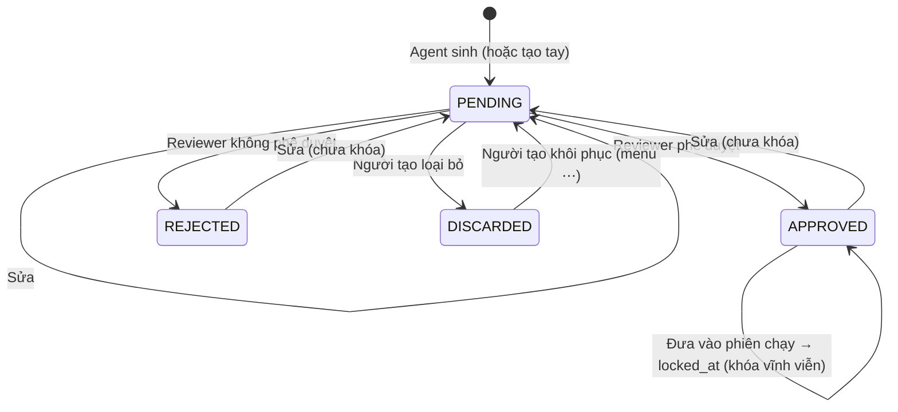

# 20 — Kịch bản không có version: sinh một lần, sửa ghi đè, khóa khi đưa vào chạy

> **Trạng thái: đã triển khai** (migration `0007_flat_test_cases`, backend `modules/testcase`, màn hình phiên Builder + chi tiết test case). Chưa làm: nhân bản. Các tài liệu cũ [02](02-backend-clean-architecture.md), [04](04-database-design.md), [05](05-api-contract.md), [06](06-auth-rbac-approval.md), [08](08-search-audit-storage.md), [10](10-testing-and-acceptance.md)–[13](13-rag-search-filter.md), [15](15-minio-object-storage.md) vẫn mô tả mô hình Version/Review cũ — tài liệu này có hiệu lực ưu tiên.

## 1. Các quyết định đã chốt

| Chủ đề | Quyết định |
|---|---|
| Version | **Bỏ.** Mỗi kịch bản là một bản ghi duy nhất |
| Sinh kịch bản | Agent **sinh một lần**, không có hội thoại qua lại. Người dùng nhập mục tiêu + ODD; **số kịch bản mỗi lượt cố định trong backend** |
| Gửi duyệt | **Không có bước gửi duyệt.** Kịch bản sinh ra vào thẳng **Chờ duyệt** |
| Duyệt | Chỉ **Phê duyệt** hoặc **Không phê duyệt**. Không nhận xét, không "yêu cầu chỉnh sửa" |
| Sửa | Sửa **ghi đè mọi nội dung**, không gọi lại Agent. Ai được sửa: người có nhiệm vụ **Tạo** hoặc **Duyệt**. Sửa xong → **Chờ duyệt** (kể cả từ Đã duyệt / Không phê duyệt) |
| Khóa | **Đưa vào phiên chạy là khóa vĩnh viễn**: không sửa, không loại bỏ, không khôi phục |
| Người tạo tự loại | Người tạo được **Loại bỏ** kịch bản của mình khi đang Chờ duyệt, để Reviewer không phải xem bản rác |
| Khôi phục | Kịch bản đã loại bỏ **khôi phục được về Chờ duyệt**, qua menu **⋯** góc phải trên cùng; đã vào phiên chạy thì không khôi phục được |
| Duyệt nhanh | Màn chi tiết có thao tác duyệt ngay, đi Trước/Sau, phím tắt |
| Duyệt hàng loạt | **Có**, ở màn danh sách |
| Nhân bản | **Để sau**, chưa làm đợt này |

## 2. Khái niệm

| Khái niệm | Là gì |
|---|---|
| **Lượt sinh** (`scenario_generations`, đã có) | Một lần gọi Agent: mục tiêu, ODD, catalog CARLA, kết quả. Sinh ra `SCENARIOS_PER_GENERATION` kịch bản |
| **Kịch bản** (`test_cases`) | Cấu hình cụ thể: tên, mô tả, map, ego, tác nhân, môi trường, mức nguy hiểm, tham số, tệp XOSC. Không có version |
| **Quyết định duyệt** (`test_case_decisions`) | Mỗi lần Phê duyệt / Không phê duyệt là một dòng, kèm hash cấu hình lúc duyệt. Một kịch bản có thể bị sửa rồi duyệt lại nhiều lần |
| **Phiên chạy** | Lượt chạy bộ kiểm thử (`test_suite_runs` → `run_jobs`). Kịch bản có trong một `run_jobs` là đã khóa |

"Đã khóa" không phải một trạng thái; đó là thuộc tính `locked_at` (có giá trị = đã khóa), đặt khi kịch bản được đưa vào phiên chạy lần đầu.

## 3. Trạng thái



| Trạng thái | Ý nghĩa | Hiện ở Hàng đợi duyệt |
|---|---|---|
| `PENDING` | Chờ Reviewer quyết định | Có |
| `APPROVED` | Reviewer chấp nhận; dùng được trong Bộ kiểm thử | Không |
| `REJECTED` | Reviewer **đã xem và không chấp nhận** — dùng đo chất lượng Agent | Không |
| `DISCARDED` | Người tạo **tự dọn**, Reviewer chưa xem — không tính vào số bị từ chối | Không (xem bằng bộ lọc) |

Chỉ kịch bản `APPROVED` mới vào được Bộ kiểm thử, nên kịch bản bị khóa luôn là `APPROVED` và không bao giờ rời trạng thái đó.

## 4. Quy tắc khóa

- **Khóa khi:** kịch bản được đưa vào phiên chạy, tức lúc backend tạo `run_jobs` cho nó (bấm **Chạy** bộ kiểm thử có chứa kịch bản). Kết quả chạy thế nào không quan trọng — lỗi môi trường, bị hủy, FAIL đều đã khóa.
- **Không khóa khi:** kịch bản chỉ nằm trong Bộ kiểm thử mà bộ chưa được chạy.
- Đặt `locked_at` **trong cùng transaction** với việc tạo `run_jobs`, sau `SELECT … FOR UPDATE` các kịch bản liên quan. Nếu có kịch bản không còn `APPROVED` (vừa bị sửa) thì không tạo job cho nó.
- Kịch bản đã khóa: ẩn **Sửa** và **Loại bỏ**, hiện nhãn "🔒 Đã đưa vào chạy mô phỏng — khóa chỉnh sửa". API sửa trả `409 TEST_CASE_LOCKED`.

Hệ quả: mọi `run_results` luôn ứng đúng với cấu hình hiện tại của kịch bản, không cần ảnh chụp cấu hình. `run_results` vẫn lưu `config_sha256` và `xosc_sha256` lúc chạy để kiểm tra chéo với Bridge.

## 5. Thao tác và quyền

| Thao tác | Ai | Điều kiện | Kết quả |
|---|---|---|---|
| Sinh kịch bản | Nhiệm vụ Tạo | — | N kịch bản `PENDING`, `created_by` = người sinh |
| Tạo tay (nếu giữ) | Nhiệm vụ Tạo | — | 1 kịch bản `PENDING` |
| **Sửa** | Nhiệm vụ **Tạo** hoặc **Duyệt** | Chưa khóa, không `DISCARDED` | Ghi đè; `status = PENDING`; `revision += 1`; `last_edited_by`; Nhật ký ghi trước/sau |
| **Loại bỏ** | Chỉ người tạo kịch bản | `PENDING`, chưa khóa | `DISCARDED`, `discarded_at` |
| **Khôi phục** | Chỉ người tạo kịch bản | `DISCARDED`, chưa khóa | `PENDING` |
| **Phê duyệt / Không phê duyệt** | Nhiệm vụ Duyệt | `PENDING`; kịch bản "của mình" cần thêm nhiệm vụ **Tự duyệt** | `APPROVED` / `REJECTED`, ghi `test_case_decisions` |
| Duyệt hàng loạt | Như trên | Từng kịch bản được kiểm riêng | Xem mục 7 |
| Thêm vào Bộ kiểm thử | Nhiệm vụ Tạo | `APPROVED` | Như hiện tại |
| Chạy bộ kiểm thử | Mọi thành viên | — | Kịch bản `APPROVED` trong bộ bị khóa; kịch bản không còn `APPROVED` bị bỏ qua |

**"Kịch bản của mình" khi duyệt** gồm cả kịch bản mình **tạo** và kịch bản mình **sửa gần nhất** (`created_by` hoặc `last_edited_by` = mình). Lý do: Reviewer được quyền sửa, nếu không tính người sửa thì một Reviewer có thể tự sửa rồi tự duyệt mà không cần nhiệm vụ Tự duyệt. *(Giả định — cần xác nhận, mục 12.)*

Quyền mới trong `policies.py`:

| Quyền | Cấp bởi |
|---|---|
| `testcase:edit` | Nhiệm vụ Tạo **và** nhiệm vụ Duyệt |
| `testcase:discard` (chỉ kịch bản của mình) | Nhiệm vụ Tạo |
| `review:decide`, `review:decide_own` | Như hiện tại |
| Bỏ: `testcase:update_own_draft`, `testcase:submit_review`, `review:comment` | — |

## 6. Màn chi tiết kịch bản — duyệt nhanh

```
← Danh sách   TC-000015 · Xe máy cắt đầu khi mưa       ● Chờ duyệt   3/12   [← Trước] [Sau →]   [⋯]
┌──────────────────────────────────────────────────────────────────────────────────────────────┐
│ [✓ Phê duyệt  A]  [✕ Không phê duyệt  R]   ☑ Tự sang kịch bản tiếp theo     [✎ Sửa  E]         │
└──────────────────────────────────────────────────────────────────────────────────────────────┘
 Cấu hình    Map Town10HD_Opt · Ego vehicle.tesla.model3 · Tác nhân motorcycle · Mưa · Nguy hiểm Cao
 Tham số     tốc độ ego 35 km/h · khoảng cách 2,1 m
 Tệp XOSC    tải về · sha256 9f2c… · revision 2
 Nguồn       Lượt sinh #88 (Agent, catalog #12) · tạo bởi Trần Văn Minh · sửa gần nhất bởi Lê An
 Kết quả chạy (nếu đã khóa)  kết luận, va chạm, TTC
 Lịch sử duyệt   Phê duyệt bởi Lê An · revision 1 · 05/10 14:02
```

| Thành phần | Hành vi |
|---|---|
| **Thanh duyệt** (dính trên cùng khi cuộn) | Chỉ hiện với người có nhiệm vụ Duyệt và kịch bản đang `PENDING`. Kịch bản của mình mà thiếu Tự duyệt → hiện dòng giải thích thay cho nút |
| **Tự sang kịch bản tiếp theo** | Bật: duyệt xong mở kịch bản kế tiếp trong danh sách đang xem. Ghi nhớ lựa chọn theo trình duyệt |
| **Trước / Sau, vị trí `3/12`** | Đi theo **đúng danh sách + bộ lọc + thứ tự** người dùng mở từ đó (truyền qua query string), không phải mọi kịch bản |
| **Phím tắt** | `A` phê duyệt · `R` không phê duyệt · `J`/`K` sau/trước · `E` sửa · `Esc` về danh sách. Không kích hoạt khi đang gõ trong ô nhập |
| **Không hỏi xác nhận khi duyệt** | Hiện thông báo "Đã phê duyệt TC-000015 · **Hoàn tác**" trong 5 giây; Hoàn tác gọi API đưa về `PENDING` và xóa dòng quyết định vừa ghi |
| **Sửa** | Mở form sửa ngay trên màn. Kịch bản đang `APPROVED`/`REJECTED` → khi lưu cảnh báo "Kịch bản sẽ quay về Chờ duyệt". Ẩn khi đã khóa |
| **Menu ⋯** (góc phải trên) | **Loại bỏ** (có hộp xác nhận) khi `PENDING` và là người tạo. **Khôi phục về Chờ duyệt** khi `DISCARDED` và là người tạo. Cả hai không hiện khi đã khóa. Sau này thêm **Nhân bản** |

## 7. Màn danh sách — duyệt hàng loạt

- Cột chọn (checkbox) ở mỗi dòng và "Chọn tất cả trên trang" / "Chọn tất cả kết quả lọc".
- Thanh hành động khi có dòng được chọn: **Phê duyệt (n)**, **Không phê duyệt (n)**, và cho người tạo: **Loại bỏ (n)**.
- Chỉ dòng **đủ điều kiện** mới tick được (đang `PENDING`, có quyền, không vướng luật tự duyệt); dòng không đủ điều kiện có tooltip lý do — giống cách prototype chặn case trùng/bị chặn.
- Backend: `POST /test-cases/decisions:batch {ids: [BIGINT…], decision}` xử lý **từng kịch bản trong transaction riêng**, trả kết quả từng dòng:

```json
{ "results": [
  { "id": 15, "status": "APPROVED" },
  { "id": 16, "error": "SELF_REVIEW_REQUIRED" },
  { "id": 17, "error": "NOT_PENDING" }
] }
```

- Giao diện báo "Đã phê duyệt 8 · bỏ qua 2 (xem chi tiết)". Mỗi kịch bản được duyệt đều ghi `test_case_decisions` và Nhật ký riêng.
- Giới hạn một lần tối đa 200 kịch bản.

## 8. Dữ liệu

### 8.1. `test_cases` (gộp với `test_case_versions`)

| Cột | Ghi chú |
|---|---|
| `id` BIGINT, `project_id`, `case_key`, `title`, `description` | Như hiện tại |
| `map_code`, `ego_vehicle_code`, `adversary_type`, `environment_code`, `danger_level`, `scenario_input` | Chuyển từ `test_case_versions` |
| `xosc_artifact_id`, `xosc_sha256` | Tệp XOSC hiện tại |
| `catalog_snapshot_id`, `generation_id` | Nguồn gốc (lượt sinh, bản dữ liệu CARLA) |
| `status` | `PENDING / APPROVED / REJECTED / DISCARDED` |
| `revision` BIGINT | Tăng mỗi lần sửa; Bridge và kết quả chạy ghi kèm |
| `config_sha256` | Hash của toàn bộ cấu hình + `xosc_sha256`; tính lại mỗi lần sửa |
| `created_by`, `last_edited_by`, `last_edited_at` | |
| `decided_by`, `decided_at` | Quyết định gần nhất |
| `discarded_at`, `locked_at` | |
| `archived_at` | Như hiện tại |

Chỉ mục: `(project_id, status)`, `(project_id, map_code)`, `(project_id, danger_level)`, `(project_id, updated_at)`.

### 8.2. `test_case_decisions` (mới, thay cho `review_requests` + `review_comments`)

| Cột | Ghi chú |
|---|---|
| `id` BIGINT, `project_id`, `test_case_id` | |
| `decision` | `APPROVED / REJECTED` |
| `revision`, `config_sha256` | Cấu hình tại thời điểm duyệt |
| `decided_by`, `decided_at` | |
| `undone_at` | Khi bấm Hoàn tác |

Tab **Lịch sử quyết định** của Hàng đợi duyệt đọc bảng này.

### 8.3. Các bảng khác

| Bảng | Thay đổi |
|---|---|
| `scenario_generations` | `accepted_version_id` → bỏ; thêm liên kết 1-nhiều tới `test_cases.generation_id`. Bỏ bước `accept` (mục 9) |
| `test_suite_items`, `run_jobs`, `run_results` | `test_case_version_id` → `test_case_id`; `run_results` thêm `revision`, `config_sha256`, `xosc_sha256` |
| `test_case_search_documents`, tag | Theo `test_case_id` |
| `review_requests`, `review_comments`, `test_case_versions` | Bỏ sau khi migrate |
| Enum `version_status`, `review_decision`, `comment_type` | Bỏ; thêm enum `test_case_status`, `test_case_decision` |

Mọi id vẫn là `BIGINT` tự tăng, không dùng UUID.

## 9. API

| Method | Path | Thay đổi |
|---|---|---|
| POST | `/scenario-generations` | Sinh `SCENARIOS_PER_GENERATION` kịch bản và **lưu thẳng** thành `test_cases` `PENDING` (không còn bước accept). Trả danh sách id |
| POST | `/scenario-generations/refine` | Giữ nguyên (chuẩn hóa form trước khi sinh, không phải hội thoại) |
| POST | `/scenario-generations/{id}/accept` | **Bỏ** |
| GET | `/test-cases`, `/test-cases/{id}` | Trả cấu hình phẳng, `status`, `revision`, `locked_at`, `can` (danh sách thao tác người gọi được làm với kịch bản này — để frontend ẩn/hiện nút) |
| PATCH | `/test-cases/{id}` | Sửa ghi đè mọi trường; `If-Match: <revision>` để tránh hai người ghi đè nhau (`409 REVISION_CONFLICT`); `409 TEST_CASE_LOCKED` nếu đã khóa |
| POST | `/test-cases/{id}/xosc` | Thay tệp XOSC (cũng là sửa → `PENDING`) |
| POST | `/test-cases/{id}/decision` | `{decision: APPROVED\|REJECTED}` |
| POST | `/test-cases/{id}/decision/undo` | Hoàn tác quyết định vừa ghi (trong 5 giây ở giao diện; backend cho phép nếu chưa có thay đổi nào sau đó) |
| POST | `/test-cases/decisions:batch` | Duyệt hàng loạt (mục 7) |
| POST | `/test-cases/{id}/discard`, `/test-cases/{id}/restore` | Loại bỏ / khôi phục |
| — | `/test-cases/{id}/versions`, `/test-case-versions/*`, `/test-case-versions/{id}/submit-review`, `/reviews/*` | **Bỏ** |

`SCENARIOS_PER_GENERATION` là biến cấu hình backend. Luồng hiện có sinh 1 kịch bản mỗi lượt; nếu đặt N > 1, backend gọi Agent N lần với `seed` khác nhau và bỏ các bản trùng `config_sha256`.

## 10. Migration từ dữ liệu có version

1. Mỗi **version** cũ thành một **kịch bản** mới, **giữ nguyên `id` của version** để khóa ngoại cũ (`test_suite_items`, `run_jobs`, `run_results`) đổi tên cột là khớp.
2. `case_key` phải duy nhất: version có `version_no` lớn nhất (bản đang dùng) giữ mã gốc; các version khác thêm hậu tố `-v<version_no>`.
3. Trạng thái: `APPROVED` → `APPROVED`; `REJECTED` → `REJECTED`; `IN_REVIEW` → `PENDING`; `DRAFT` → `PENDING`; `EDIT` → `REJECTED`.
4. `review_requests` đã có quyết định → một dòng `test_case_decisions` (`APPROVED`/`REJECTED`; `EDIT` → `REJECTED`). Nội dung `review_comments` chép vào Nhật ký hoạt động rồi bỏ bảng.
5. Version đã có `run_jobs` → đặt `locked_at` = thời điểm job đầu tiên.
6. Viết migration Alembic mới (`0002_...`) theo baseline hiện tại, có kiểm tra số dòng trước/sau; chạy thử trên bản sao DB thật trước.

## 11. Ảnh hưởng tới phần đã làm

| Phần | Thay đổi |
|---|---|
| Hàng đợi duyệt (đợt 1) | Bỏ ô nhận xét, nút Yêu cầu chỉnh sửa; danh sách đọc `test_cases` `PENDING`; Lịch sử đọc `test_case_decisions` (bỏ cột Lý do, thêm revision) |
| Tổng quan (đợt 1) | Thẻ "Cần chỉnh sửa" → "Không phê duyệt"; "Chờ duyệt" đếm `test_cases` `PENDING` |
| Kịch bản kiểm thử, chi tiết, màn version | Gộp thành danh sách + chi tiết mới (mục 6, 7); bỏ màn version, nút sao chép version |
| Tạo kịch bản bằng Agent | Bỏ bước accept/"Lưu thành version"; sinh xong chuyển tới danh sách kịch bản `PENDING` của lượt sinh |
| Test Case Builder, tạo tay | Tạo kịch bản `PENDING` trực tiếp, cùng quy tắc sửa/khóa |
| Bộ kiểm thử, Kết quả chạy | Trỏ `test_case_id`; bỏ qua kịch bản không còn `APPROVED` khi chạy; đặt `locked_at` khi tạo job |
| Bridge (doc 18) | `job.assign` gửi `test_case_id + revision + config_sha256 + xosc_sha256` thay cho `version_id` |
| Tài liệu | Cập nhật 06 (vòng đời, quyền), 16 (bảng quyền, màn), 18 (hợp đồng job), 19 (bỏ accept/version) |

## 12. Giả định cần xác nhận

1. **Luật tự duyệt tính cả người sửa gần nhất** (mục 5). Nếu không muốn, Reviewer có thể sửa rồi tự duyệt mà không cần nhiệm vụ Tự duyệt.
2. **Ai sửa cũng được, không chỉ người tạo**: mọi người có nhiệm vụ Tạo hoặc Duyệt trong Project đều sửa được mọi kịch bản chưa khóa.
3. **Loại bỏ và Khôi phục chỉ dành cho người tạo** kịch bản; Quản trị viên không có quyền riêng.
4. **Không phê duyệt không cần lý do.**
5. **Còn giữ đường tạo tay / Builder** song song với Agent.

## 13. Để sau

- **Nhân bản**: sao chép một kịch bản (kể cả đã khóa) thành kịch bản mới `PENDING`, liên kết `source_case_id`, không gọi Agent. Mục **Nhân bản** sẽ nằm trong menu ⋯.
- Đếm/báo cáo chất lượng Agent theo tỉ lệ `REJECTED` / `DISCARDED` trên mỗi lượt sinh (màn Chất lượng).
